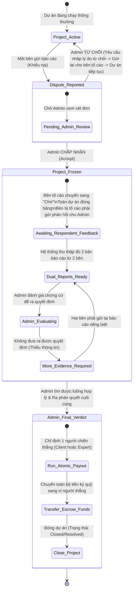

# AI-Tasker Source Code Documentation (`frontend/src`)

This document contains a comprehensive analysis and explanation of all files inside the `frontend/src` directory of the **AI-Tasker** project.

---

## 1. Project Entry & Core Routing
These files boot up the frontend React application, load global configurations, and handle page routing.

### 📄 [`app/App.jsx`](file:///d:/FPT/FPTU_LearnAndTest/FPT_Learning_Lesson/Course5_Summer2026/SWP301/AI-Tasker_Root/frontend/src/app/App.jsx)
- **Lines of Code**: 23
- **Role/Purpose**: The root component of the application. It sets up the main Providers (like AuthProvider, Router, Theme) and wraps the layout.
- **Key Functions/Components**: `App`

### 📄 [`app/routes.jsx`](file:///d:/FPT/FPTU_LearnAndTest/FPT_Learning_Lesson/Course5_Summer2026/SWP301/AI-Tasker_Root/frontend/src/app/routes.jsx)
- **Lines of Code**: 230
- **Role/Purpose**: Defines all application routes, including role-based routing (Admin, Client, Expert, Owner, Public) and redirects.
- **Key Functions/Components**: `ProposalReviewLegacyRedirect, LegacyProposalRedirect, UnauthorizedPage`

### 📄 [`main.jsx`](file:///d:/FPT/FPTU_LearnAndTest/FPT_Learning_Lesson/Course5_Summer2026/SWP301/AI-Tasker_Root/frontend/src/main.jsx)
- **Lines of Code**: 6
- **Role/Purpose**: The entry point of the React application. Mounts the root component onto the DOM and imports styles.
- **Key Functions/Components**: `N/A`

---

## 2. Page Components & Routing Views
This section details the view pages grouped by user role. They orchestrate API calls, manage screen state, and render dashboard widgets.

### 👥 Public / Guest Views
*Pages accessible to anyone without logging in, such as landing page, authentication form pages (Login, SignUp, ForgotPassword), and public expert lists.*

#### 📄 [`app/pages/public/ExpertsPage.jsx`](file:///d:/FPT/FPTU_LearnAndTest/FPT_Learning_Lesson/Course5_Summer2026/SWP301/AI-Tasker_Root/frontend/src/app/pages/public/ExpertsPage.jsx)
- **Lines of Code**: 118
- **Role/Purpose**: ExpertsPage — public expert discovery/browsing page. TODO: Connect to backend API to list and search experts. This page is kept as a future API-ready placeholder.
- **Key Components/Functions**: `ExpertsPage`
#### 📄 [`app/pages/public/ForgotPasswordPage.jsx`](file:///d:/FPT/FPTU_LearnAndTest/FPT_Learning_Lesson/Course5_Summer2026/SWP301/AI-Tasker_Root/frontend/src/app/pages/public/ForgotPasswordPage.jsx)
- **Lines of Code**: 122
- **Role/Purpose**: ForgotPasswordPage — password reset request screen. TODO: Connect to backend API for email sending.
- **Key Components/Functions**: `ForgotPasswordPage`
#### 📄 [`app/pages/public/HomePage.jsx`](file:///d:/FPT/FPTU_LearnAndTest/FPT_Learning_Lesson/Course5_Summer2026/SWP301/AI-Tasker_Root/frontend/src/app/pages/public/HomePage.jsx)
- **Lines of Code**: 130
- **Role/Purpose**: Component or helper file implementing key client/server logic.
- **Key Components/Functions**: `HomePage, handleClickOutside`
#### 📄 [`app/pages/public/LoginPage.jsx`](file:///d:/FPT/FPTU_LearnAndTest/FPT_Learning_Lesson/Course5_Summer2026/SWP301/AI-Tasker_Root/frontend/src/app/pages/public/LoginPage.jsx)
- **Lines of Code**: 308
- **Role/Purpose**: Component or helper file implementing key client/server logic.
- **Key Components/Functions**: `LoginPage`
#### 📄 [`app/pages/public/NotFound.jsx`](file:///d:/FPT/FPTU_LearnAndTest/FPT_Learning_Lesson/Course5_Summer2026/SWP301/AI-Tasker_Root/frontend/src/app/pages/public/NotFound.jsx)
- **Lines of Code**: 54
- **Role/Purpose**: Component or helper file implementing key client/server logic.
- **Key Components/Functions**: `NotFound`
#### 📄 [`app/pages/public/SignUpPage.jsx`](file:///d:/FPT/FPTU_LearnAndTest/FPT_Learning_Lesson/Course5_Summer2026/SWP301/AI-Tasker_Root/frontend/src/app/pages/public/SignUpPage.jsx)
- **Lines of Code**: 295
- **Role/Purpose**: Component or helper file implementing key client/server logic.
- **Key Components/Functions**: `SignUpPage`

### 👥 Client / Buyer Views
*Pages for project creators (clients) to post tasks, manage jobs, review proposals, manage active projects, and process escrow payments.*

#### 📄 [`app/pages/client/Billing.jsx`](file:///d:/FPT/FPTU_LearnAndTest/FPT_Learning_Lesson/Course5_Summer2026/SWP301/AI-Tasker_Root/frontend/src/app/pages/client/Billing.jsx)
- **Lines of Code**: 427
- **Role/Purpose**: Helpers
- **Key Components/Functions**: `Icon, Billing, fetchData`
#### 📄 [`app/pages/client/ClientDashboard.jsx`](file:///d:/FPT/FPTU_LearnAndTest/FPT_Learning_Lesson/Course5_Summer2026/SWP301/AI-Tasker_Root/frontend/src/app/pages/client/ClientDashboard.jsx)
- **Lines of Code**: 450
- **Role/Purpose**: Dashboard main interface for the client role.
- **Key Components/Functions**: `SKILL_VISIBLE_COUNT, computeExpertRating, ClientDashboard, loadDashboardData`
#### 📄 [`app/pages/client/ClientProfile.jsx`](file:///d:/FPT/FPTU_LearnAndTest/FPT_Learning_Lesson/Course5_Summer2026/SWP301/AI-Tasker_Root/frontend/src/app/pages/client/ClientProfile.jsx)
- **Lines of Code**: 292
- **Role/Purpose**: Resolve the client user from auth. Returns the auth user directly. TODO: Connect to real API for full profile data.
- **Key Components/Functions**: `resolveClient, ClientProfile, fetchProfile`
#### 📄 [`app/pages/client/ClientProjectManagement.jsx`](file:///d:/FPT/FPTU_LearnAndTest/FPT_Learning_Lesson/Course5_Summer2026/SWP301/AI-Tasker_Root/frontend/src/app/pages/client/ClientProjectManagement.jsx)
- **Lines of Code**: 904
- **Role/Purpose**: ClientProjectManagement — client-side project progress management page. Route: /client/projects/:id
- **Key Components/Functions**: `TERMINAL_STATUSES, FINAL_DELIVERY_DONE, ClientProjectDetail, loadReport, DeliveryPaymentStepper, showExplanationModal`
#### 📄 [`app/pages/client/EditClientProfile.jsx`](file:///d:/FPT/FPTU_LearnAndTest/FPT_Learning_Lesson/Course5_Summer2026/SWP301/AI-Tasker_Root/frontend/src/app/pages/client/EditClientProfile.jsx)
- **Lines of Code**: 187
- **Role/Purpose**: Component
- **Key Components/Functions**: `EditClientProfile`
#### 📄 [`app/pages/client/ExpertList.jsx`](file:///d:/FPT/FPTU_LearnAndTest/FPT_Learning_Lesson/Course5_Summer2026/SWP301/AI-Tasker_Root/frontend/src/app/pages/client/ExpertList.jsx)
- **Lines of Code**: 453
- **Role/Purpose**: Checkbox group — reusable inner component
- **Key Components/Functions**: `CheckboxGroup, ExpertList, loadExperts`
#### 📄 [`app/pages/client/MyProjectsPage.jsx`](file:///d:/FPT/FPTU_LearnAndTest/FPT_Learning_Lesson/Course5_Summer2026/SWP301/AI-Tasker_Root/frontend/src/app/pages/client/MyProjectsPage.jsx)
- **Lines of Code**: 1095
- **Role/Purpose**: Component or helper file implementing key client/server logic.
- **Key Components/Functions**: `MyProjectsList, loadProjects, fetchProposals`
#### 📄 [`app/pages/client/PostProject.jsx`](file:///d:/FPT/FPTU_LearnAndTest/FPT_Learning_Lesson/Course5_Summer2026/SWP301/AI-Tasker_Root/frontend/src/app/pages/client/PostProject.jsx)
- **Lines of Code**: 1227
- **Role/Purpose**: ── Timeline unit conversion helpers ──
- **Key Components/Functions**: `CATEGORY_DATA, PostProject`
#### 📄 [`app/pages/client/ProjectDetail.jsx`](file:///d:/FPT/FPTU_LearnAndTest/FPT_Learning_Lesson/Course5_Summer2026/SWP301/AI-Tasker_Root/frontend/src/app/pages/client/ProjectDetail.jsx)
- **Lines of Code**: 389
- **Role/Purpose**: ClientProjectDetail — Project detail page for Client role. ⚠️  DEPRECATED — NOT in active routing. routes.jsx imports ProjectDetail from ClientProjectManagement.jsx,
- **Key Components/Functions**: `ProjectDetail`
#### 📄 [`app/pages/client/ProposalReview.jsx`](file:///d:/FPT/FPTU_LearnAndTest/FPT_Learning_Lesson/Course5_Summer2026/SWP301/AI-Tasker_Root/frontend/src/app/pages/client/ProposalReview.jsx)
- **Lines of Code**: 367
- **Role/Purpose**: ProposalReview — Client views all proposals for a specific project. Route: /client/projects/:projectId/proposals
- **Key Components/Functions**: `ProposalReview`

### 👥 Expert / Freelancer Views
*Pages for experts to search/apply for jobs, submit proposals, manage active project deliverables, request timeline extensions, and manage their wallets.*

#### 📄 [`app/pages/expert/EditExpertProfile.jsx`](file:///d:/FPT/FPTU_LearnAndTest/FPT_Learning_Lesson/Course5_Summer2026/SWP301/AI-Tasker_Root/frontend/src/app/pages/expert/EditExpertProfile.jsx)
- **Lines of Code**: 658
- **Role/Purpose**: Profile view and management page for editexpert users.
- **Key Components/Functions**: `CATEGORY_DATA, EditExpertProfile`
#### 📄 [`app/pages/expert/ExpertDashboard.jsx`](file:///d:/FPT/FPTU_LearnAndTest/FPT_Learning_Lesson/Course5_Summer2026/SWP301/AI-Tasker_Root/frontend/src/app/pages/expert/ExpertDashboard.jsx)
- **Lines of Code**: 591
- **Role/Purpose**: Dashboard main interface for the expert role.
- **Key Components/Functions**: `SKILL_VISIBLE_COUNT, getMatchPct, calculateMatchPct, ExpertDashboard, loadDashboardData`
#### 📄 [`app/pages/expert/ExpertProfile.jsx`](file:///d:/FPT/FPTU_LearnAndTest/FPT_Learning_Lesson/Course5_Summer2026/SWP301/AI-Tasker_Root/frontend/src/app/pages/expert/ExpertProfile.jsx)
- **Lines of Code**: 315
- **Role/Purpose**: Profile view and management page for expert users.
- **Key Components/Functions**: `ExpertProfile, fetchProfile`
#### 📄 [`app/pages/expert/ExpertProjectDetail.jsx`](file:///d:/FPT/FPTU_LearnAndTest/FPT_Learning_Lesson/Course5_Summer2026/SWP301/AI-Tasker_Root/frontend/src/app/pages/expert/ExpertProjectDetail.jsx)
- **Lines of Code**: 343
- **Role/Purpose**: ExpertProjectDetail — Project detail page for Expert role. ⚠️  DEPRECATED — NOT in active routing. routes.jsx imports ExpertProjectDetail from ExpertProjectManagement.jsx,
- **Key Components/Functions**: `ExpertProjectDetail, loadProject, loadReport`
#### 📄 [`app/pages/expert/ExpertProjectManagement.jsx`](file:///d:/FPT/FPTU_LearnAndTest/FPT_Learning_Lesson/Course5_Summer2026/SWP301/AI-Tasker_Root/frontend/src/app/pages/expert/ExpertProjectManagement.jsx)
- **Lines of Code**: 678
- **Role/Purpose**: ExpertProjectManagement — expert-side project progress management page. Route: /expert/projects/:id
- **Key Components/Functions**: `ExpertProjectDetail, loadReport, ExpertDeliveryStepper, showExplanationModal`
#### 📄 [`app/pages/expert/ExpertWallet.jsx`](file:///d:/FPT/FPTU_LearnAndTest/FPT_Learning_Lesson/Course5_Summer2026/SWP301/AI-Tasker_Root/frontend/src/app/pages/expert/ExpertWallet.jsx)
- **Lines of Code**: 273
- **Role/Purpose**: Helpers
- **Key Components/Functions**: `resolveExpertId, getExpertWalletData, ExpertWallet, fetchData`
#### 📄 [`app/pages/expert/JobDetail.jsx`](file:///d:/FPT/FPTU_LearnAndTest/FPT_Learning_Lesson/Course5_Summer2026/SWP301/AI-Tasker_Root/frontend/src/app/pages/expert/JobDetail.jsx)
- **Lines of Code**: 287
- **Role/Purpose**: Detailed detail and interaction view for a specific job.
- **Key Components/Functions**: `JobDetail, fetchJob`
#### 📄 [`app/pages/expert/JobList.jsx`](file:///d:/FPT/FPTU_LearnAndTest/FPT_Learning_Lesson/Course5_Summer2026/SWP301/AI-Tasker_Root/frontend/src/app/pages/expert/JobList.jsx)
- **Lines of Code**: 529
- **Role/Purpose**: Job Card — renders a scannable job listing card for the expert job board.
- **Key Components/Functions**: `ProjectCard, JobList, loadData`
#### 📄 [`app/pages/expert/ProposalDetail.jsx`](file:///d:/FPT/FPTU_LearnAndTest/FPT_Learning_Lesson/Course5_Summer2026/SWP301/AI-Tasker_Root/frontend/src/app/pages/expert/ProposalDetail.jsx)
- **Lines of Code**: 494
- **Role/Purpose**: Status helpers — delegated to shared proposalStatusConfig.js
- **Key Components/Functions**: `StatusIcon, getStatusConfig, DetailSection, ProposalDetail, getConversationId`
#### 📄 [`app/pages/expert/ProposalStatus.jsx`](file:///d:/FPT/FPTU_LearnAndTest/FPT_Learning_Lesson/Course5_Summer2026/SWP301/AI-Tasker_Root/frontend/src/app/pages/expert/ProposalStatus.jsx)
- **Lines of Code**: 220
- **Role/Purpose**: Status helpers — delegated to shared proposalStatusConfig.js
- **Key Components/Functions**: `StatusIcon, getStatusConfig, findConversationId, relativeTime, ProposalStatus, loadProposals`
#### 📄 [`app/pages/expert/SendProposal.jsx`](file:///d:/FPT/FPTU_LearnAndTest/FPT_Learning_Lesson/Course5_Summer2026/SWP301/AI-Tasker_Root/frontend/src/app/pages/expert/SendProposal.jsx)
- **Lines of Code**: 1042
- **Role/Purpose**: SendProposal — Expert submits a comprehensive proposal to a client project.
- **Key Components/Functions**: `SendProposal`

### 👥 Admin Views
*Pages for platform administrators to moderate content, check project reviews, handle disputes, manage users, categories, tags, and track site revenue.*

#### 📄 [`app/pages/admin/AdminCategoryTags.jsx`](file:///d:/FPT/FPTU_LearnAndTest/FPT_Learning_Lesson/Course5_Summer2026/SWP301/AI-Tasker_Root/frontend/src/app/pages/admin/AdminCategoryTags.jsx)
- **Lines of Code**: 582
- **Role/Purpose**: AdminCategoryTags — Skills & Categories management page for Admin/Owner. Uses existing /api/category-tags endpoints. Admin/Owner can: - View skills list with search
- **Key Components/Functions**: `TABS, Icon, errorMessage, AdminCategoryTags`
#### 📄 [`app/pages/admin/AdminDashboard.jsx`](file:///d:/FPT/FPTU_LearnAndTest/FPT_Learning_Lesson/Course5_Summer2026/SWP301/AI-Tasker_Root/frontend/src/app/pages/admin/AdminDashboard.jsx)
- **Lines of Code**: 175
- **Role/Purpose**: AdminDashboard — Dashboard overview page for Admin/Owner. Shows platform stats and quick links to all management pages.
- **Key Components/Functions**: `DASHBOARD_TIMEOUT, SkeletonValue, Icon, AdminDashboard`
#### 📄 [`app/pages/admin/AdminDisputes.jsx`](file:///d:/FPT/FPTU_LearnAndTest/FPT_Learning_Lesson/Course5_Summer2026/SWP301/AI-Tasker_Root/frontend/src/app/pages/admin/AdminDisputes.jsx)
- **Lines of Code**: 216
- **Role/Purpose**: AdminDisputes — Dispute report list page for Admin/Owner. Shows all dispute reports with: - Status filter (Pending, Accepted, Rejected, Under Review, Resolved, Closed)
- **Key Components/Functions**: `REPORT_STATUS_CONFIG, STATUS_OPTIONS, AdminDisputes`
#### 📄 [`app/pages/admin/AdminJobPosts.jsx`](file:///d:/FPT/FPTU_LearnAndTest/FPT_Learning_Lesson/Course5_Summer2026/SWP301/AI-Tasker_Root/frontend/src/app/pages/admin/AdminJobPosts.jsx)
- **Lines of Code**: 313
- **Role/Purpose**: AdminJobPosts — Job post / Service list management for Admin/Owner. Uses existing /api/jobposts endpoint. Admin can: - View all job posts
- **Key Components/Functions**: `JOB_POST_STATUS_CONFIG, JOB_POST_STATUS_OPTIONS, AdminJobPosts`
#### 📄 [`app/pages/admin/AdminProfile.jsx`](file:///d:/FPT/FPTU_LearnAndTest/FPT_Learning_Lesson/Course5_Summer2026/SWP301/AI-Tasker_Root/frontend/src/app/pages/admin/AdminProfile.jsx)
- **Lines of Code**: 163
- **Role/Purpose**: Resolve the full admin user object from auth email → mock DB. Falls back to the demo admin user-002 if email lookup fails.
- **Key Components/Functions**: `resolveAdmin, AdminProfile`
#### 📄 [`app/pages/admin/AdminProjects.jsx`](file:///d:/FPT/FPTU_LearnAndTest/FPT_Learning_Lesson/Course5_Summer2026/SWP301/AI-Tasker_Root/frontend/src/app/pages/admin/AdminProjects.jsx)
- **Lines of Code**: 194
- **Role/Purpose**: AdminProjects — Project list management for Admin/Owner. Shows all platform projects with: - Search by title
- **Key Components/Functions**: `PROJECT_STATUS_CONFIG, STATUS_OPTIONS, AdminProjects`
#### 📄 [`app/pages/admin/AdminReportDetail.jsx`](file:///d:/FPT/FPTU_LearnAndTest/FPT_Learning_Lesson/Course5_Summer2026/SWP301/AI-Tasker_Root/frontend/src/app/pages/admin/AdminReportDetail.jsx)
- **Lines of Code**: 1145
- **Role/Purpose**: AdminReportDetail — Full dispute report detail & handling page. Admin actions: 1. View report details (project, client, expert, evidence, etc.)
- **Key Components/Functions**: `REPORT_STATUS_CONFIG, AdminReportDetail, calculateTime`
#### 📄 [`app/pages/admin/AdminRevenue.jsx`](file:///d:/FPT/FPTU_LearnAndTest/FPT_Learning_Lesson/Course5_Summer2026/SWP301/AI-Tasker_Root/frontend/src/app/pages/admin/AdminRevenue.jsx)
- **Lines of Code**: 153
- **Role/Purpose**: Default data — renders immediately; API data replaces it when available.
- **Key Components/Functions**: `DEFAULT_DATA, AdminRevenue, fetchRevenue`
#### 📄 [`app/pages/admin/AdminReviews.jsx`](file:///d:/FPT/FPTU_LearnAndTest/FPT_Learning_Lesson/Course5_Summer2026/SWP301/AI-Tasker_Root/frontend/src/app/pages/admin/AdminReviews.jsx)
- **Lines of Code**: 289
- **Role/Purpose**: AdminReviews — Review list management for Admin/Owner. Shows all platform reviews with: - Search by content/user
- **Key Components/Functions**: `REVIEW_STATUS_CONFIG, REVIEW_STATUS_OPTIONS, AdminReviews`
#### 📄 [`app/pages/admin/AdminUsers.jsx`](file:///d:/FPT/FPTU_LearnAndTest/FPT_Learning_Lesson/Course5_Summer2026/SWP301/AI-Tasker_Root/frontend/src/app/pages/admin/AdminUsers.jsx)
- **Lines of Code**: 316
- **Role/Purpose**: AdminUsers — User management page for Admin/Owner. Uses existing /api/users endpoint. Admin/Owner can: - View user list with search
- **Key Components/Functions**: `ROLE_COLORS, STATUS_CONFIG, ROLE_FILTER_OPTIONS, AdminUsers`
#### 📄 [`app/pages/admin/EditAdminProfile.jsx`](file:///d:/FPT/FPTU_LearnAndTest/FPT_Learning_Lesson/Course5_Summer2026/SWP301/AI-Tasker_Root/frontend/src/app/pages/admin/EditAdminProfile.jsx)
- **Lines of Code**: 165
- **Role/Purpose**: Resolve admin user from mock DB
- **Key Components/Functions**: `resolveAdmin, EditAdminProfile`

### 👥 Owner / Platform Creator Views
*Master controls for the platform owner to create/manage administrator accounts and oversee high-level administrative details.*

#### 📄 [`app/pages/owner/CreateAdmin.jsx`](file:///d:/FPT/FPTU_LearnAndTest/FPT_Learning_Lesson/Course5_Summer2026/SWP301/AI-Tasker_Root/frontend/src/app/pages/owner/CreateAdmin.jsx)
- **Lines of Code**: 280
- **Role/Purpose**: CreateAdmin — Owner-only page to create new Admin accounts. Uses /api/users/register if backend supports passing role=admin, otherwise falls back to ownerService.createAdminAccount() placeholder.
- **Key Components/Functions**: `CreateAdmin`
#### 📄 [`app/pages/owner/EditOwnerProfile.jsx`](file:///d:/FPT/FPTU_LearnAndTest/FPT_Learning_Lesson/Course5_Summer2026/SWP301/AI-Tasker_Root/frontend/src/app/pages/owner/EditOwnerProfile.jsx)
- **Lines of Code**: 175
- **Role/Purpose**: EditOwnerProfile — Edit profile page for Owner role. Allows the Owner to update their display name, email, title, phone, location, and bio in the mock DB.
- **Key Components/Functions**: `resolveOwner, EditOwnerProfile`
#### 📄 [`app/pages/owner/ManageAdmins.jsx`](file:///d:/FPT/FPTU_LearnAndTest/FPT_Learning_Lesson/Course5_Summer2026/SWP301/AI-Tasker_Root/frontend/src/app/pages/owner/ManageAdmins.jsx)
- **Lines of Code**: 259
- **Role/Purpose**: ManageAdmins — Owner-only page to view and manage Admin accounts. Owner can: - View list of all Admin accounts
- **Key Components/Functions**: `ADMIN_STATUS_CONFIG, ManageAdmins`
#### 📄 [`app/pages/owner/OwnerCategoryTags.jsx`](file:///d:/FPT/FPTU_LearnAndTest/FPT_Learning_Lesson/Course5_Summer2026/SWP301/AI-Tasker_Root/frontend/src/app/pages/owner/OwnerCategoryTags.jsx)
- **Lines of Code**: 20
- **Role/Purpose**: OwnerCategoryTags — Owner view of category/skill tag management. Reuses AdminCategoryTags component internally with Owner context.
- **Key Components/Functions**: `OwnerCategoryTags`
#### 📄 [`app/pages/owner/OwnerDashboard.jsx`](file:///d:/FPT/FPTU_LearnAndTest/FPT_Learning_Lesson/Course5_Summer2026/SWP301/AI-Tasker_Root/frontend/src/app/pages/owner/OwnerDashboard.jsx)
- **Lines of Code**: 416
- **Role/Purpose**: OwnerDashboard — Statistics dashboard for Owner role. Charts: - Monthly Client/Expert visits (bar chart)
- **Key Components/Functions**: `MONTHS, YEAR_OPTIONS, OwnerDashboard, ChartCard`
#### 📄 [`app/pages/owner/OwnerJobPosts.jsx`](file:///d:/FPT/FPTU_LearnAndTest/FPT_Learning_Lesson/Course5_Summer2026/SWP301/AI-Tasker_Root/frontend/src/app/pages/owner/OwnerJobPosts.jsx)
- **Lines of Code**: 20
- **Role/Purpose**: OwnerJobPosts — Owner view of job post/service management. Reuses AdminJobPosts component internally with Owner context.
- **Key Components/Functions**: `OwnerJobPosts`
#### 📄 [`app/pages/owner/OwnerProfile.jsx`](file:///d:/FPT/FPTU_LearnAndTest/FPT_Learning_Lesson/Course5_Summer2026/SWP301/AI-Tasker_Root/frontend/src/app/pages/owner/OwnerProfile.jsx)
- **Lines of Code**: 175
- **Role/Purpose**: OwnerProfile — View profile page for Owner role. Shows the Owner's personal information with a link to edit.
- **Key Components/Functions**: `resolveOwner, OwnerProfile`
#### 📄 [`app/pages/owner/OwnerProjects.jsx`](file:///d:/FPT/FPTU_LearnAndTest/FPT_Learning_Lesson/Course5_Summer2026/SWP301/AI-Tasker_Root/frontend/src/app/pages/owner/OwnerProjects.jsx)
- **Lines of Code**: 20
- **Role/Purpose**: OwnerProjects — Owner view of project management. Reuses AdminProjects component internally with Owner context.
- **Key Components/Functions**: `OwnerProjects`
#### 📄 [`app/pages/owner/OwnerReports.jsx`](file:///d:/FPT/FPTU_LearnAndTest/FPT_Learning_Lesson/Course5_Summer2026/SWP301/AI-Tasker_Root/frontend/src/app/pages/owner/OwnerReports.jsx)
- **Lines of Code**: 20
- **Role/Purpose**: OwnerReports — Owner view of dispute/report management. Reuses AdminDisputes component internally with Owner context.
- **Key Components/Functions**: `OwnerReports`
#### 📄 [`app/pages/owner/OwnerReviews.jsx`](file:///d:/FPT/FPTU_LearnAndTest/FPT_Learning_Lesson/Course5_Summer2026/SWP301/AI-Tasker_Root/frontend/src/app/pages/owner/OwnerReviews.jsx)
- **Lines of Code**: 20
- **Role/Purpose**: OwnerReviews — Owner view of review management. Reuses AdminReviews component internally with Owner context.
- **Key Components/Functions**: `OwnerReviews`
#### 📄 [`app/pages/owner/OwnerUsers.jsx`](file:///d:/FPT/FPTU_LearnAndTest/FPT_Learning_Lesson/Course5_Summer2026/SWP301/AI-Tasker_Root/frontend/src/app/pages/owner/OwnerUsers.jsx)
- **Lines of Code**: 21
- **Role/Purpose**: OwnerUsers — Owner view of user management. Reuses AdminUsers component internally with Owner context. Admin accounts are excluded — they are managed via ManageAdmins page.
- **Key Components/Functions**: `OwnerUsers`

### 👥 Common / Shared Views
*Features shared across roles, including the real-time-like Messenger, custom NotificationsPage, and shared TaskDetailPage.*

#### 📄 [`app/pages/common/Messenger.jsx`](file:///d:/FPT/FPTU_LearnAndTest/FPT_Learning_Lesson/Course5_Summer2026/SWP301/AI-Tasker_Root/frontend/src/app/pages/common/Messenger.jsx)
- **Lines of Code**: 586
- **Role/Purpose**: In-memory session messages — appended when user sends a message in the UI
- **Key Components/Functions**: `ATTACH_OPTIONS, detectCurrentUser, Messenger`
#### 📄 [`app/pages/common/NotificationsPage.jsx`](file:///d:/FPT/FPTU_LearnAndTest/FPT_Learning_Lesson/Course5_Summer2026/SWP301/AI-Tasker_Root/frontend/src/app/pages/common/NotificationsPage.jsx)
- **Lines of Code**: 292
- **Role/Purpose**: Icons and formatting
- **Key Components/Functions**: `Icon, groupByDate, NotificationsPage`
#### 📄 [`app/pages/common/TaskDetailPage.jsx`](file:///d:/FPT/FPTU_LearnAndTest/FPT_Learning_Lesson/Course5_Summer2026/SWP301/AI-Tasker_Root/frontend/src/app/pages/common/TaskDetailPage.jsx)
- **Lines of Code**: 1309
- **Role/Purpose**: Component or helper file implementing key client/server logic.
- **Key Components/Functions**: `TaskDetailPage, TaskAcceptanceStepper`
#### 📄 [`app/pages/common/TaskUpdatePage.jsx`](file:///d:/FPT/FPTU_LearnAndTest/FPT_Learning_Lesson/Course5_Summer2026/SWP301/AI-Tasker_Root/frontend/src/app/pages/common/TaskUpdatePage.jsx)
- **Lines of Code**: 446
- **Role/Purpose**: Import real mock DB functions for data persistence
- **Key Components/Functions**: `findTaskById, toggleMockMiniTask, updateMockMiniTaskNote, markTaskSubmitted, approveTaskInMockDb, requestTaskRevisionInMockDb, TaskUpdatePage`

---

## 3. Services (API & Database Simulation)
These files handle business logic, data persistence (using a local storage / memory database for demonstration), and asynchronous network simulations.

### ⚙️ [`app/services/mockDatabase.js`](file:///d:/FPT/FPTU_LearnAndTest/FPT_Learning_Lesson/Course5_Summer2026/SWP301/AI-Tasker_Root/frontend/src/app/services/mockDatabase.js)
- **Lines of Code**: 2
- **Role/Purpose**: In-memory database holding mock data for projects, proposals, disputes, messages, and users.
- **Exports**: `N/A`

### ⚙️ [`services/api.js`](file:///d:/FPT/FPTU_LearnAndTest/FPT_Learning_Lesson/Course5_Summer2026/SWP301/AI-Tasker_Root/frontend/src/services/api.js)
- **Lines of Code**: 358
- **Role/Purpose**: Configures global API client or mock API request handlers with delay simulations.
- **Exports**: `API_BASE_URL, TOKEN_STORAGE_KEY, getToken, clearToken, request, get, post, put, patch, del, buildQuery`

### ⚙️ [`services/authService.js`](file:///d:/FPT/FPTU_LearnAndTest/FPT_Learning_Lesson/Course5_Summer2026/SWP301/AI-Tasker_Root/frontend/src/services/authService.js)
- **Lines of Code**: 120
- **Role/Purpose**: Service functions for user login, signup, password reset, and fetching user profiles.
- **Exports**: `login, register, forgotPassword, resetPassword, refreshToken`

### ⚙️ [`services/categoryTagService.js`](file:///d:/FPT/FPTU_LearnAndTest/FPT_Learning_Lesson/Course5_Summer2026/SWP301/AI-Tasker_Root/frontend/src/services/categoryTagService.js)
- **Lines of Code**: 98
- **Role/Purpose**: Manages skill categories and tags (fetch tags, create tags, edit categories).
- **Exports**: `BASE, getSkills, createSkill, deleteSkill, getCategories, createCategory, deleteCategory`

### ⚙️ [`services/disputeService.js`](file:///d:/FPT/FPTU_LearnAndTest/FPT_Learning_Lesson/Course5_Summer2026/SWP301/AI-Tasker_Root/frontend/src/services/disputeService.js)
- **Lines of Code**: 119
- **Role/Purpose**: Handles project disputes, resolution offers, and admin escalation.
- **Exports**: `DISPUTE_ENDPOINTS, pauseProjectAsDisputed, continueProject, stopProject, createDisputeChat`

### ⚙️ [`services/escrowService.js`](file:///d:/FPT/FPTU_LearnAndTest/FPT_Learning_Lesson/Course5_Summer2026/SWP301/AI-Tasker_Root/frontend/src/services/escrowService.js)
- **Lines of Code**: 187
- **Role/Purpose**: Manages escrow transactions, deposits, releases, and payment logs.
- **Exports**: `ESCROW_ENDPOINTS, payProjectToEscrow, releaseProjectMoneyToExpert, refundProjectMoneyToClient, cancelProjectContract`

### ⚙️ [`services/notificationHelper.js`](file:///d:/FPT/FPTU_LearnAndTest/FPT_Learning_Lesson/Course5_Summer2026/SWP301/AI-Tasker_Root/frontend/src/services/notificationHelper.js)
- **Lines of Code**: 370
- **Role/Purpose**: Utility for sending, reading, and managing notifications.
- **Exports**: `sendNotification, notifyNewProposal, notifyUpdatedProposal, notifyProposalDecision, notifyEscrowFunded, notifyTaskSubmittedForReview, notifyTaskApproved, notifyTaskRevisionRequested, notifyMiniTaskRevisionRequested, notifyTaskOverdue, notifyUrgentSubmissionRequested, notifyFinalWorkSubmitted, notifyFinalDeliveryAccepted, notifyFinalDeliveryDeclined, notifyPaymentReleased, notifyDisputeFiled, notifyDisputeResolved, notifyMoreEvidenceRequested, notifyContractCancelledExpert, notifyContractCancelledClient`

### ⚙️ [`services/ownerService.js`](file:///d:/FPT/FPTU_LearnAndTest/FPT_Learning_Lesson/Course5_Summer2026/SWP301/AI-Tasker_Root/frontend/src/services/ownerService.js)
- **Lines of Code**: 203
- **Role/Purpose**: Service APIs dedicated to owner actions (creating admins, system configurations).
- **Exports**: `OWNER_ENDPOINTS, createAdminAccount, banAdminAccount, getAdminUsers, getOwnerDashboardStats, getMonthlyTrafficStats, getYearlyPostStats, getTotalPaymentStats`

### ⚙️ [`services/reportService.js`](file:///d:/FPT/FPTU_LearnAndTest/FPT_Learning_Lesson/Course5_Summer2026/SWP301/AI-Tasker_Root/frontend/src/services/reportService.js)
- **Lines of Code**: 124
- **Role/Purpose**: Manages project reports, abuse complaints, and resolution feedback.
- **Exports**: `REPORT_ENDPOINTS, createReport, getReports, getReportDetail, acceptReport, rejectReport`

---

## 4. Libs & Helper Utilities
Pure functions, state stores, helper configurations, and application constants.

### 🛠️ [`app/lib/auditTrail.js`](file:///d:/FPT/FPTU_LearnAndTest/FPT_Learning_Lesson/Course5_Summer2026/SWP301/AI-Tasker_Root/frontend/src/app/lib/auditTrail.js)
- **Lines of Code**: 82
- **Role/Purpose**: System for logging user actions and critical transitions (audit log) to the mock database.
- **Exports**: `addTaskAuditEntry, getTaskAuditLogs, getProjectAuditLogs, formatAuditMessage`

### 🛠️ [`app/lib/dateUtils.js`](file:///d:/FPT/FPTU_LearnAndTest/FPT_Learning_Lesson/Course5_Summer2026/SWP301/AI-Tasker_Root/frontend/src/app/lib/dateUtils.js)
- **Lines of Code**: 69
- **Role/Purpose**: Helper functions to parse, format, and compute differences between dates.
- **Exports**: `timeAgo, formatDate, formatDateTime`

### 🛠️ [`app/lib/demoConfig.js`](file:///d:/FPT/FPTU_LearnAndTest/FPT_Learning_Lesson/Course5_Summer2026/SWP301/AI-Tasker_Root/frontend/src/app/lib/demoConfig.js)
- **Lines of Code**: 9
- **Role/Purpose**: Configuration options for the demo/presentation mode of the app.
- **Exports**: `DEMO_CLIENT_ID, DEMO_EXPERT_ID, DEMO_ADMIN_ID`

### 🛠️ [`app/lib/formatCurrency.js`](file:///d:/FPT/FPTU_LearnAndTest/FPT_Learning_Lesson/Course5_Summer2026/SWP301/AI-Tasker_Root/frontend/src/app/lib/formatCurrency.js)
- **Lines of Code**: 105
- **Role/Purpose**: Formats numbers to currency strings (e.g. USD, VND) for displaying wages and budgets.
- **Exports**: `formatCurrency, formatCompactCurrency, parseCurrencyInput`

### 🛠️ [`app/lib/projectStatusConfig.js`](file:///d:/FPT/FPTU_LearnAndTest/FPT_Learning_Lesson/Course5_Summer2026/SWP301/AI-Tasker_Root/frontend/src/app/lib/projectStatusConfig.js)
- **Lines of Code**: 288
- **Role/Purpose**: Config definitions and styling for project statuses (Pending, In Progress, Completed, Disputed, etc.).
- **Exports**: `STATUS_LABELS, STATUS_BADGE_CLASSES, CLIENT_BUTTON_MAP, EXPERT_BUTTON_MAP, TASK_STATUS_CONFIG, DEADLINE_STATUS_CONFIG, getStatusBadgeClass, getStatusLabel, getExpertDisplayInfo, getClientButtonConfig, getExpertButtonConfig, deriveProjectStatusKey, deriveProjectDisplayStatus, getTaskStatusClass, getTaskStatusLabel, getDeadlineStatusClass, getDeadlineStatusLabel`

### 🛠️ [`app/lib/projectTimelineStore.js`](file:///d:/FPT/FPTU_LearnAndTest/FPT_Learning_Lesson/Course5_Summer2026/SWP301/AI-Tasker_Root/frontend/src/app/lib/projectTimelineStore.js)
- **Lines of Code**: 578
- **Role/Purpose**: Stores the timeline states, milestones, extension requests, and activity logs.
- **Exports**: `TASK_STATUS_MAP, MINI_TASK_STATUS_MAP, ACTOR_MAP, addProjectActivity, getMergedActivityLogs, clearRuntimeActivityLogs, buildTimelineFromMockDb, getProjectTimeline, submitTask, approveSubmission, requestRevision, requestExtension, resolveExtension, updateTask, updateMiniTask, addTaskLog, addTaskFeedback, resetProjectTimeline, getProjectProgress, deriveTaskStatus, deriveTaskProgress, getTaskMiniTaskProgress, getOverallProgress, getDeadlineInfo`

### 🛠️ [`app/lib/proposalStatusConfig.js`](file:///d:/FPT/FPTU_LearnAndTest/FPT_Learning_Lesson/Course5_Summer2026/SWP301/AI-Tasker_Root/frontend/src/app/lib/proposalStatusConfig.js)
- **Lines of Code**: 95
- **Role/Purpose**: Config definitions and styling (colors, badges) for different proposal statuses.
- **Exports**: `PROPOSAL_STATUS, getProposalStatusConfig, getProposalStatusLabel, getProposalStatusClass`

### 🛠️ [`app/lib/proposalStore.js`](file:///d:/FPT/FPTU_LearnAndTest/FPT_Learning_Lesson/Course5_Summer2026/SWP301/AI-Tasker_Root/frontend/src/app/lib/proposalStore.js)
- **Lines of Code**: 80
- **Role/Purpose**: Handles state and operations for proposals (submit proposal, change status, fetch proposals).
- **Exports**: `addSessionProposal, getSessionProposalsByExpert, getSessionProposalById, acceptProposal, declineProposal, getMatchPercentage`

### 🛠️ [`app/lib/recommendationHelper.js`](file:///d:/FPT/FPTU_LearnAndTest/FPT_Learning_Lesson/Course5_Summer2026/SWP301/AI-Tasker_Root/frontend/src/app/lib/recommendationHelper.js)
- **Lines of Code**: 140
- **Role/Purpose**: Helper functions to recommend matching experts for a project based on skills and ratings.
- **Exports**: `getRecommendedProjects`

### 🛠️ [`app/lib/safety.js`](file:///d:/FPT/FPTU_LearnAndTest/FPT_Learning_Lesson/Course5_Summer2026/SWP301/AI-Tasker_Root/frontend/src/app/lib/safety.js)
- **Lines of Code**: 143
- **Role/Purpose**: Content moderation and safety check helper functions (e.g. anti-spam, profanity filter).
- **Exports**: `safeArray, safeGet, safeNum, safeDateFormat, safeDateTimeFormat, safePercent, safeJsonParse, safeNumberFormat`

### 🛠️ [`app/lib/utils.js`](file:///d:/FPT/FPTU_LearnAndTest/FPT_Learning_Lesson/Course5_Summer2026/SWP301/AI-Tasker_Root/frontend/src/app/lib/utils.js)
- **Lines of Code**: 7
- **Role/Purpose**: Utility functions, including standard Tailwind CSS class merging using clsx and tailwind-merge.
- **Exports**: `cn`

---

## 5. React Hooks & Contexts
Global state managers and reusable logic hooks.

### 🌐 Contexts
#### 📄 [app/context/AuthContext.jsx](file:///d:/FPT/FPTU_LearnAndTest/FPT_Learning_Lesson/Course5_Summer2026/SWP301/AI-Tasker_Root/frontend/src/app/context/AuthContext.jsx)
- **Lines of Code**: 386
- **Role/Purpose**: React Context that manages authentication state, mock login, logout, and stores current user profile.

### ⚓ Hooks
#### 📄 [app/hooks/use-mobile.js](file:///d:/FPT/FPTU_LearnAndTest/FPT_Learning_Lesson/Course5_Summer2026/SWP301/AI-Tasker_Root/frontend/src/app/hooks/use-mobile.js)
- **Lines of Code**: 20
- **Role/Purpose**: Detects whether the user is on mobile screen sizing constraints.
#### 📄 [app/hooks/useAuth.js](file:///d:/FPT/FPTU_LearnAndTest/FPT_Learning_Lesson/Course5_Summer2026/SWP301/AI-Tasker_Root/frontend/src/app/hooks/useAuth.js)
- **Lines of Code**: 2
- **Role/Purpose**: Hook to access authorization status, logged-in user details, login/logout functions from AuthContext.
#### 📄 [app/hooks/useConfetti.js](file:///d:/FPT/FPTU_LearnAndTest/FPT_Learning_Lesson/Course5_Summer2026/SWP301/AI-Tasker_Root/frontend/src/app/hooks/useConfetti.js)
- **Lines of Code**: 39
- **Role/Purpose**: Provides canvas-confetti trigger functionality for celebration effects when tasks/projects complete.
#### 📄 [app/hooks/useProjectProgress.js](file:///d:/FPT/FPTU_LearnAndTest/FPT_Learning_Lesson/Course5_Summer2026/SWP301/AI-Tasker_Root/frontend/src/app/hooks/useProjectProgress.js)
- **Lines of Code**: 523
- **Role/Purpose**: Manages project-specific milestone calculations, tasks, and status progress.
#### 📄 [app/hooks/useProjectTimeline.js](file:///d:/FPT/FPTU_LearnAndTest/FPT_Learning_Lesson/Course5_Summer2026/SWP301/AI-Tasker_Root/frontend/src/app/hooks/useProjectTimeline.js)
- **Lines of Code**: 247
- **Role/Purpose**: Manages the state and action handlers for the project timeline actions (milestones, extensions, tasks).
#### 📄 [app/hooks/useScrollReveal.js](file:///d:/FPT/FPTU_LearnAndTest/FPT_Learning_Lesson/Course5_Summer2026/SWP301/AI-Tasker_Root/frontend/src/app/hooks/useScrollReveal.js)
- **Lines of Code**: 47
- **Role/Purpose**: Triggers fade-in/reveal animations on scroll for landing pages.

---

## 6. Shared Components (Domain and Layout)
Domain-specific custom React components, including project cards, timeline components, proposal card views, landing section widgets, and header layouts.

### 🧩 Project-Specific Components
#### 📄 [app/components/project/ConfirmMiniTasksModal.jsx](file:///d:/FPT/FPTU_LearnAndTest/FPT_Learning_Lesson/Course5_Summer2026/SWP301/AI-Tasker_Root/frontend/src/app/components/project/ConfirmMiniTasksModal.jsx)
- **Lines of Code**: 36
- **Role/Purpose**: ConfirmMiniTasksModal — confirmation dialog shown before locking mini tasks. Props: open        — boolean
- **Component(s)**: `ConfirmMiniTasksModal`
#### 📄 [app/components/project/MiniTaskChecklist.jsx](file:///d:/FPT/FPTU_LearnAndTest/FPT_Learning_Lesson/Course5_Summer2026/SWP301/AI-Tasker_Root/frontend/src/app/components/project/MiniTaskChecklist.jsx)
- **Lines of Code**: 355
- **Role/Purpose**: MiniTaskChecklist — reusable mini-task checklist with role-based permissions. Props: miniTasks     — array of mini task objects
- **Component(s)**: `MiniTaskChecklist`
#### 📄 [app/components/project/MiniTaskCreateForm.jsx](file:///d:/FPT/FPTU_LearnAndTest/FPT_Learning_Lesson/Course5_Summer2026/SWP301/AI-Tasker_Root/frontend/src/app/components/project/MiniTaskCreateForm.jsx)
- **Lines of Code**: 271
- **Role/Purpose**: MiniTaskCreateForm — expert-only form to create, edit, remove, and reorder mini tasks before confirmation. Props:
- **Component(s)**: `MiniTaskCreateForm`
#### 📄 [app/components/project/ProjectHeaderCard.jsx](file:///d:/FPT/FPTU_LearnAndTest/FPT_Learning_Lesson/Course5_Summer2026/SWP301/AI-Tasker_Root/frontend/src/app/components/project/ProjectHeaderCard.jsx)
- **Lines of Code**: 274
- **Role/Purpose**: ProjectHeaderCard — project info header with status, names, budget, dates, tags. Props: project        — project object
- **Component(s)**: `ProjectHeaderCard`
#### 📄 [app/components/project/ProjectProgressPanel.jsx](file:///d:/FPT/FPTU_LearnAndTest/FPT_Learning_Lesson/Course5_Summer2026/SWP301/AI-Tasker_Root/frontend/src/app/components/project/ProjectProgressPanel.jsx)
- **Lines of Code**: 243
- **Role/Purpose**: ProjectProgressPanel — overall project progress section with task cards. Props: tasks              — array of tasks with progress and status
- **Component(s)**: `ProjectProgressPanel`
#### 📄 [app/components/project/ProjectTimelineManager.jsx](file:///d:/FPT/FPTU_LearnAndTest/FPT_Learning_Lesson/Course5_Summer2026/SWP301/AI-Tasker_Root/frontend/src/app/components/project/ProjectTimelineManager.jsx)
- **Lines of Code**: 288
- **Role/Purpose**: Interactive timeline editor and viewer for project milestones and tasks.
- **Component(s)**: `ProjectTimelineManager`
#### 📄 [app/components/project/TaskActivityTimeline.jsx](file:///d:/FPT/FPTU_LearnAndTest/FPT_Learning_Lesson/Course5_Summer2026/SWP301/AI-Tasker_Root/frontend/src/app/components/project/TaskActivityTimeline.jsx)
- **Lines of Code**: 145
- **Role/Purpose**: Visual timeline logging task completions, submissions, comments, and extension requests.
- **Component(s)**: `ACTION_ICONS, ACTION_COLORS, IconComponent, TaskActivityTimeline`
#### 📄 [app/components/project/TaskProgressCard.jsx](file:///d:/FPT/FPTU_LearnAndTest/FPT_Learning_Lesson/Course5_Summer2026/SWP301/AI-Tasker_Root/frontend/src/app/components/project/TaskProgressCard.jsx)
- **Lines of Code**: 565
- **Role/Purpose**: Card layout summarizing milestones completed and overall project health/progress.
- **Component(s)**: `TaskProgressCard`
#### 📄 [app/components/project/timeline/ActivityLogPanel.jsx](file:///d:/FPT/FPTU_LearnAndTest/FPT_Learning_Lesson/Course5_Summer2026/SWP301/AI-Tasker_Root/frontend/src/app/components/project/timeline/ActivityLogPanel.jsx)
- **Lines of Code**: 48
- **Role/Purpose**: Renders detailed system actions, message history, and project history logs.
- **Component(s)**: `ActivityLogPanel`
#### 📄 [app/components/project/timeline/ExtensionRequestPanel.jsx](file:///d:/FPT/FPTU_LearnAndTest/FPT_Learning_Lesson/Course5_Summer2026/SWP301/AI-Tasker_Root/frontend/src/app/components/project/timeline/ExtensionRequestPanel.jsx)
- **Lines of Code**: 167
- **Role/Purpose**: UI interface for experts to request deadline extensions and clients to approve/reject them.
- **Component(s)**: `ExtensionRequestPanel`
#### 📄 [app/components/project/timeline/TaskActionButtons.jsx](file:///d:/FPT/FPTU_LearnAndTest/FPT_Learning_Lesson/Course5_Summer2026/SWP301/AI-Tasker_Root/frontend/src/app/components/project/timeline/TaskActionButtons.jsx)
- **Lines of Code**: 68
- **Role/Purpose**: Buttons triggering actions like submitting deliverables, approving tasks, or starting disputes.
- **Component(s)**: `TaskActionButtons`
#### 📄 [app/components/project/timeline/TaskCard.jsx](file:///d:/FPT/FPTU_LearnAndTest/FPT_Learning_Lesson/Course5_Summer2026/SWP301/AI-Tasker_Root/frontend/src/app/components/project/timeline/TaskCard.jsx)
- **Lines of Code**: 107
- **Role/Purpose**: Renders detail of a single task/milestone in the project timeline.
- **Component(s)**: `TaskCard`
#### 📄 [app/components/project/timeline/timelineHelpers.jsx](file:///d:/FPT/FPTU_LearnAndTest/FPT_Learning_Lesson/Course5_Summer2026/SWP301/AI-Tasker_Root/frontend/src/app/components/project/timeline/timelineHelpers.jsx)
- **Lines of Code**: 13
- **Role/Purpose**: Helper logic for converting raw timeline data into visual nodes.
- **Component(s)**: `getActorIcon`

### 🧩 Proposal-Specific Components
#### 📄 [app/components/proposal/ProposalCard.jsx](file:///d:/FPT/FPTU_LearnAndTest/FPT_Learning_Lesson/Course5_Summer2026/SWP301/AI-Tasker_Root/frontend/src/app/components/proposal/ProposalCard.jsx)
- **Lines of Code**: 293
- **Role/Purpose**: Renders a card representing a proposal submitted by an expert to a project.
- **Component(s)**: `ProposalCard`

### 🧩 Report-Specific Components
#### 📄 [app/components/report/ReportButton.jsx](file:///d:/FPT/FPTU_LearnAndTest/FPT_Learning_Lesson/Course5_Summer2026/SWP301/AI-Tasker_Root/frontend/src/app/components/report/ReportButton.jsx)
- **Lines of Code**: 105
- **Role/Purpose**: Generic button trigger that displays the ReportForm dialog for flagging content.
- **Component(s)**: `ReportButton`
#### 📄 [app/components/report/ReportForm.jsx](file:///d:/FPT/FPTU_LearnAndTest/FPT_Learning_Lesson/Course5_Summer2026/SWP301/AI-Tasker_Root/frontend/src/app/components/report/ReportForm.jsx)
- **Lines of Code**: 374
- **Role/Purpose**: Modal form to report users, job posts, or projects for violations.
- **Component(s)**: `DISPUTE_TYPES, ReportForm, InfoRow`

### 🧩 AI Planning Components
#### 📄 [app/components/ai/AIClientsUseCasePlanner.jsx](file:///d:/FPT/FPTU_LearnAndTest/FPT_Learning_Lesson/Course5_Summer2026/SWP301/AI-Tasker_Root/frontend/src/app/components/ai/AIClientsUseCasePlanner.jsx)
- **Lines of Code**: 304
- **Role/Purpose**: Planner view helping clients structure their requirements using preset AI templates.
- **Component(s)**: `generateClientUseCases, AIClientsUseCasePlanner`
#### 📄 [app/components/ai/AIFileUploadZone.jsx](file:///d:/FPT/FPTU_LearnAndTest/FPT_Learning_Lesson/Course5_Summer2026/SWP301/AI-Tasker_Root/frontend/src/app/components/ai/AIFileUploadZone.jsx)
- **Lines of Code**: 216
- **Role/Purpose**: File dropzone that leverages simulated AI parsing to extract project details.
- **Component(s)**: `DEFAULT_ACCEPT_EXT, FileIcon, Icon, getFileIcon, getFileColor, formatFileSize, AIFileUploadZone`
#### 📄 [app/components/ai/AIPlannerCard.jsx](file:///d:/FPT/FPTU_LearnAndTest/FPT_Learning_Lesson/Course5_Summer2026/SWP301/AI-Tasker_Root/frontend/src/app/components/ai/AIPlannerCard.jsx)
- **Lines of Code**: 74
- **Role/Purpose**: Visual summary card of AI planner recommendations for task distributions.
- **Component(s)**: `AIPlannerCard`
#### 📄 [app/components/ai/AIPlannerDrawer.jsx](file:///d:/FPT/FPTU_LearnAndTest/FPT_Learning_Lesson/Course5_Summer2026/SWP301/AI-Tasker_Root/frontend/src/app/components/ai/AIPlannerDrawer.jsx)
- **Lines of Code**: 384
- **Role/Purpose**: Slide-out drawer offering interactive AI assistance for mapping out milestone objectives.
- **Component(s)**: `generateId, buildMockPlan, AIPlannerPanel`

### 🧩 Authentication Layout Guards
#### 📄 [app/components/auth/ProtectedRoute.jsx](file:///d:/FPT/FPTU_LearnAndTest/FPT_Learning_Lesson/Course5_Summer2026/SWP301/AI-Tasker_Root/frontend/src/app/components/auth/ProtectedRoute.jsx)
- **Lines of Code**: 53
- **Role/Purpose**: Wrapper ensuring only authenticated users with specific roles can access protected pages.
- **Component(s)**: `ProtectedRoute`

### 🧩 Landing Page Components
#### 📄 [app/components/landing/FeaturedExperts.jsx](file:///d:/FPT/FPTU_LearnAndTest/FPT_Learning_Lesson/Course5_Summer2026/SWP301/AI-Tasker_Root/frontend/src/app/components/landing/FeaturedExperts.jsx)
- **Lines of Code**: 55
- **Role/Purpose**: TODO: Replace with API call when backend is ready
- **Component(s)**: `FeaturedExperts`
#### 📄 [app/components/landing/HeroSection.jsx](file:///d:/FPT/FPTU_LearnAndTest/FPT_Learning_Lesson/Course5_Summer2026/SWP301/AI-Tasker_Root/frontend/src/app/components/landing/HeroSection.jsx)
- **Lines of Code**: 211
- **Role/Purpose**: Component or helper file implementing key client/server logic.
- **Component(s)**: `WorkflowNode, HeroProductMap, HeroSection`
#### 📄 [app/components/landing/HowItWorks.jsx](file:///d:/FPT/FPTU_LearnAndTest/FPT_Learning_Lesson/Course5_Summer2026/SWP301/AI-Tasker_Root/frontend/src/app/components/landing/HowItWorks.jsx)
- **Lines of Code**: 108
- **Role/Purpose**: Component or helper file implementing key client/server logic.
- **Component(s)**: `Icon, StepCard, HowItWorks`
#### 📄 [app/components/landing/ProductShowcase.jsx](file:///d:/FPT/FPTU_LearnAndTest/FPT_Learning_Lesson/Course5_Summer2026/SWP301/AI-Tasker_Root/frontend/src/app/components/landing/ProductShowcase.jsx)
- **Lines of Code**: 240
- **Role/Purpose**: Component or helper file implementing key client/server logic.
- **Component(s)**: `Icon, BrowserFrame, MatchingMockup, DashboardMockup, ProgressMockup, MessagesMockup, MockupContent, ShowcaseCard, ProductShowcase, BriefcaseIcon`

### 🧩 Layout Containers
#### 📄 [app/components/layout/Footer.jsx](file:///d:/FPT/FPTU_LearnAndTest/FPT_Learning_Lesson/Course5_Summer2026/SWP301/AI-Tasker_Root/frontend/src/app/components/layout/Footer.jsx)
- **Lines of Code**: 33
- **Role/Purpose**: Footer displaying app branding, copyright, and relevant links.
- **Component(s)**: `Footer`
#### 📄 [app/components/layout/Header.jsx](file:///d:/FPT/FPTU_LearnAndTest/FPT_Learning_Lesson/Course5_Summer2026/SWP301/AI-Tasker_Root/frontend/src/app/components/layout/Header.jsx)
- **Lines of Code**: 380
- **Role/Purpose**: App navigation header showing roles switcher, notifications, messages icons, and user avatar dropdown.
- **Component(s)**: `Header, handleClickOutside`
#### 📄 [app/components/layout/RootLayout.jsx](file:///d:/FPT/FPTU_LearnAndTest/FPT_Learning_Lesson/Course5_Summer2026/SWP301/AI-Tasker_Root/frontend/src/app/components/layout/RootLayout.jsx)
- **Lines of Code**: 41
- **Role/Purpose**: Main layout wrapper structure with Header, Footer, and responsive container layout.
- **Component(s)**: `RootLayout`

### 🧩 Shared Layout / General Components
#### 📄 [app/components/shared/AnimatedReveal.jsx](file:///d:/FPT/FPTU_LearnAndTest/FPT_Learning_Lesson/Course5_Summer2026/SWP301/AI-Tasker_Root/frontend/src/app/components/shared/AnimatedReveal.jsx)
- **Lines of Code**: 75
- **Role/Purpose**: Wrapper component using Framer Motion or CSS transitions to reveal contents on scroll/load.
- **Component(s)**: `DIRECTION_STYLES, AnimatedReveal`
#### 📄 [app/components/shared/BackButton.jsx](file:///d:/FPT/FPTU_LearnAndTest/FPT_Learning_Lesson/Course5_Summer2026/SWP301/AI-Tasker_Root/frontend/src/app/components/shared/BackButton.jsx)
- **Lines of Code**: 44
- **Role/Purpose**: A standard back navigation button with custom icon styling.
- **Component(s)**: `BackButton`
#### 📄 [app/components/shared/ConfirmationModal.jsx](file:///d:/FPT/FPTU_LearnAndTest/FPT_Learning_Lesson/Course5_Summer2026/SWP301/AI-Tasker_Root/frontend/src/app/components/shared/ConfirmationModal.jsx)
- **Lines of Code**: 98
- **Role/Purpose**: Generic modal asking for user confirmation before executing critical actions.
- **Component(s)**: `ConfirmationModal`
#### 📄 [app/components/shared/DashboardStats.jsx](file:///d:/FPT/FPTU_LearnAndTest/FPT_Learning_Lesson/Course5_Summer2026/SWP301/AI-Tasker_Root/frontend/src/app/components/shared/DashboardStats.jsx)
- **Lines of Code**: 49
- **Role/Purpose**: Grid of key metrics shown on admin/client/expert dashboards.
- **Component(s)**: `DashboardStats`
#### 📄 [app/components/shared/DataTable.jsx](file:///d:/FPT/FPTU_LearnAndTest/FPT_Learning_Lesson/Course5_Summer2026/SWP301/AI-Tasker_Root/frontend/src/app/components/shared/DataTable.jsx)
- **Lines of Code**: 154
- **Role/Purpose**: Reusable table component supporting sorting, search, pagination, and actions.
- **Component(s)**: `DataTable`
#### 📄 [app/components/shared/DisputeBanner.jsx](file:///d:/FPT/FPTU_LearnAndTest/FPT_Learning_Lesson/Course5_Summer2026/SWP301/AI-Tasker_Root/frontend/src/app/components/shared/DisputeBanner.jsx)
- **Lines of Code**: 62
- **Role/Purpose**: Highlighted alert banner shown when a project is in the Disputed state.
- **Component(s)**: `DisputeBanner, calculateTime`
#### 📄 [app/components/shared/EmptyState.jsx](file:///d:/FPT/FPTU_LearnAndTest/FPT_Learning_Lesson/Course5_Summer2026/SWP301/AI-Tasker_Root/frontend/src/app/components/shared/EmptyState.jsx)
- **Lines of Code**: 185
- **Role/Purpose**: Generic empty state display with illustrations and actionable buttons.
- **Component(s)**: `SIZES, TYPE_DEFAULTS, ResolvedIcon, EmptyState`
#### 📄 [app/components/shared/ErrorBoundary.jsx](file:///d:/FPT/FPTU_LearnAndTest/FPT_Learning_Lesson/Course5_Summer2026/SWP301/AI-Tasker_Root/frontend/src/app/components/shared/ErrorBoundary.jsx)
- **Lines of Code**: 133
- **Role/Purpose**: React Error Boundary component catching exceptions to display a fallback error UI.
- **Component(s)**: `getDashboardPath`
#### 📄 [app/components/shared/FileUploadDropzone.jsx](file:///d:/FPT/FPTU_LearnAndTest/FPT_Learning_Lesson/Course5_Summer2026/SWP301/AI-Tasker_Root/frontend/src/app/components/shared/FileUploadDropzone.jsx)
- **Lines of Code**: 314
- **Role/Purpose**: Drag-and-drop file upload component simulating uploading files and generating URLs.
- **Component(s)**: `DEFAULT_ACCEPT_MIME, DEFAULT_ACCEPT_EXT, FileIcon, Icon, getFileIcon, getFileColor, formatFileSize, FileUploadDropzone`
#### 📄 [app/components/shared/illustrations/AIProjectIllustration.jsx](file:///d:/FPT/FPTU_LearnAndTest/FPT_Learning_Lesson/Course5_Summer2026/SWP301/AI-Tasker_Root/frontend/src/app/components/shared/illustrations/AIProjectIllustration.jsx)
- **Lines of Code**: 102
- **Role/Purpose**: Decorative SVG illustration representing AI/Tech collaborations.
- **Component(s)**: `SIZES, AIProjectIllustration, hexPoints`
#### 📄 [app/components/shared/illustrations/CollaborationIllustration.jsx](file:///d:/FPT/FPTU_LearnAndTest/FPT_Learning_Lesson/Course5_Summer2026/SWP301/AI-Tasker_Root/frontend/src/app/components/shared/illustrations/CollaborationIllustration.jsx)
- **Lines of Code**: 124
- **Role/Purpose**: Decorative SVG illustration representing team work and client-expert relations.
- **Component(s)**: `SIZES, CollaborationIllustration`
#### 📄 [app/components/shared/illustrations/ProjectTimelineIllustration.jsx](file:///d:/FPT/FPTU_LearnAndTest/FPT_Learning_Lesson/Course5_Summer2026/SWP301/AI-Tasker_Root/frontend/src/app/components/shared/illustrations/ProjectTimelineIllustration.jsx)
- **Lines of Code**: 115
- **Role/Purpose**: Decorative SVG illustration representing project schedules and goals.
- **Component(s)**: `SIZES, MILESTONES, ProjectTimelineIllustration`
#### 📄 [app/components/shared/ImageWithFallback.jsx](file:///d:/FPT/FPTU_LearnAndTest/FPT_Learning_Lesson/Course5_Summer2026/SWP301/AI-Tasker_Root/frontend/src/app/components/shared/ImageWithFallback.jsx)
- **Lines of Code**: 28
- **Role/Purpose**: Image component rendering a fallback placeholder if the primary URL fails to load.
- **Component(s)**: `ERROR_IMG_SRC, ImageWithFallback`
#### 📄 [app/components/shared/LoadingSkeleton.jsx](file:///d:/FPT/FPTU_LearnAndTest/FPT_Learning_Lesson/Course5_Summer2026/SWP301/AI-Tasker_Root/frontend/src/app/components/shared/LoadingSkeleton.jsx)
- **Lines of Code**: 123
- **Role/Purpose**: Placeholder skeleton loader for views that are currently fetching data.
- **Component(s)**: `DEFAULT_COUNTS, RENDERERS, Renderer, CardSkeleton, ListSkeleton, DashboardSkeleton, DetailSkeleton, LoadingSkeleton`
#### 📄 [app/components/shared/MoneyDisplay.jsx](file:///d:/FPT/FPTU_LearnAndTest/FPT_Learning_Lesson/Course5_Summer2026/SWP301/AI-Tasker_Root/frontend/src/app/components/shared/MoneyDisplay.jsx)
- **Lines of Code**: 25
- **Role/Purpose**: Nicely formatted monetary values with custom currencies and size styling.
- **Component(s)**: `MoneyDisplay`
#### 📄 [app/components/shared/PageHeader.jsx](file:///d:/FPT/FPTU_LearnAndTest/FPT_Learning_Lesson/Course5_Summer2026/SWP301/AI-Tasker_Root/frontend/src/app/components/shared/PageHeader.jsx)
- **Lines of Code**: 70
- **Role/Purpose**: Consistent header component for pages with title, subtitle, and primary actions.
- **Component(s)**: `PageHeader`
#### 📄 [app/components/shared/PublicExpertProfile.jsx](file:///d:/FPT/FPTU_LearnAndTest/FPT_Learning_Lesson/Course5_Summer2026/SWP301/AI-Tasker_Root/frontend/src/app/components/shared/PublicExpertProfile.jsx)
- **Lines of Code**: 478
- **Role/Purpose**: Public-facing profile view of an expert including reviews, portfolio, and skills.
- **Component(s)**: `PublicExpertProfile, fetchExpert, loadOpenPosts`
#### 📄 [app/components/shared/SectionCard.jsx](file:///d:/FPT/FPTU_LearnAndTest/FPT_Learning_Lesson/Course5_Summer2026/SWP301/AI-Tasker_Root/frontend/src/app/components/shared/SectionCard.jsx)
- **Lines of Code**: 107
- **Role/Purpose**: Card container with header, body, and custom padding for layout layout sections.
- **Component(s)**: `PADDING, VARIANTS, SectionCard`
#### 📄 [app/components/shared/SkillTags.jsx](file:///d:/FPT/FPTU_LearnAndTest/FPT_Learning_Lesson/Course5_Summer2026/SWP301/AI-Tasker_Root/frontend/src/app/components/shared/SkillTags.jsx)
- **Lines of Code**: 55
- **Role/Purpose**: Renders a list of interactive or static tags representing expert/project skills.
- **Component(s)**: `SkillTags`
#### 📄 [app/components/shared/StatCard.jsx](file:///d:/FPT/FPTU_LearnAndTest/FPT_Learning_Lesson/Course5_Summer2026/SWP301/AI-Tasker_Root/frontend/src/app/components/shared/StatCard.jsx)
- **Lines of Code**: 162
- **Role/Purpose**: Individual card showing a single metric, trend indicator, and icon.
- **Component(s)**: `SIZE_STYLES, COLOR_PRESETS, StatCard`
#### 📄 [app/components/shared/StatusBadge.jsx](file:///d:/FPT/FPTU_LearnAndTest/FPT_Learning_Lesson/Course5_Summer2026/SWP301/AI-Tasker_Root/frontend/src/app/components/shared/StatusBadge.jsx)
- **Lines of Code**: 60
- **Role/Purpose**: Stylized badge displaying statuses like Active, Completed, Pending in unified design systems.
- **Component(s)**: `ENTITY_CONFIG, StatusBadge`

---

## 7. Styles & Configuration
Tailwind base files, theme designs, and custom typography.

### 🎨 [`styles/fonts.css`](file:///d:/FPT/FPTU_LearnAndTest/FPT_Learning_Lesson/Course5_Summer2026/SWP301/AI-Tasker_Root/frontend/src/styles/fonts.css)
- **Lines of Code**: 28
- **Role/Purpose**: Stylesheets configuring colors, components, fonts, tailwind layers, and global UI definitions.

### 🎨 [`styles/globals.css`](file:///d:/FPT/FPTU_LearnAndTest/FPT_Learning_Lesson/Course5_Summer2026/SWP301/AI-Tasker_Root/frontend/src/styles/globals.css)
- **Lines of Code**: 51
- **Role/Purpose**: Stylesheets configuring colors, components, fonts, tailwind layers, and global UI definitions.

### 🎨 [`styles/index.css`](file:///d:/FPT/FPTU_LearnAndTest/FPT_Learning_Lesson/Course5_Summer2026/SWP301/AI-Tasker_Root/frontend/src/styles/index.css)
- **Lines of Code**: 4
- **Role/Purpose**: Stylesheets configuring colors, components, fonts, tailwind layers, and global UI definitions.

### 🎨 [`styles/tailwind.css`](file:///d:/FPT/FPTU_LearnAndTest/FPT_Learning_Lesson/Course5_Summer2026/SWP301/AI-Tasker_Root/frontend/src/styles/tailwind.css)
- **Lines of Code**: 5
- **Role/Purpose**: Stylesheets configuring colors, components, fonts, tailwind layers, and global UI definitions.

### 🎨 [`styles/theme.css`](file:///d:/FPT/FPTU_LearnAndTest/FPT_Learning_Lesson/Course5_Summer2026/SWP301/AI-Tasker_Root/frontend/src/styles/theme.css)
- **Lines of Code**: 793
- **Role/Purpose**: Stylesheets configuring colors, components, fonts, tailwind layers, and global UI definitions.

---

## 8. UI Building Blocks (Shadcn UI Library)
These are reusable, accessible primitives configured using `radix-ui` and Tailwind CSS. They form the UI design system.

| File Path | Lines | Type / Purpose |
|---|---|---|
| [`app/components/ui/accordion.jsx`](file:///d:/FPT/FPTU_LearnAndTest/FPT_Learning_Lesson/Course5_Summer2026/SWP301/AI-Tasker_Root/frontend/src/app/components/ui/accordion.jsx) | 51 | Shadcn UI reusable `accordion` primitive component |
| [`app/components/ui/alert-dialog.jsx`](file:///d:/FPT/FPTU_LearnAndTest/FPT_Learning_Lesson/Course5_Summer2026/SWP301/AI-Tasker_Root/frontend/src/app/components/ui/alert-dialog.jsx) | 125 | Shadcn UI reusable `alert-dialog` primitive component |
| [`app/components/ui/alert.jsx`](file:///d:/FPT/FPTU_LearnAndTest/FPT_Learning_Lesson/Course5_Summer2026/SWP301/AI-Tasker_Root/frontend/src/app/components/ui/alert.jsx) | 58 | Shadcn UI reusable `alert` primitive component |
| [`app/components/ui/aspect-ratio.jsx`](file:///d:/FPT/FPTU_LearnAndTest/FPT_Learning_Lesson/Course5_Summer2026/SWP301/AI-Tasker_Root/frontend/src/app/components/ui/aspect-ratio.jsx) | 8 | Shadcn UI reusable `aspect-ratio` primitive component |
| [`app/components/ui/avatar.jsx`](file:///d:/FPT/FPTU_LearnAndTest/FPT_Learning_Lesson/Course5_Summer2026/SWP301/AI-Tasker_Root/frontend/src/app/components/ui/avatar.jsx) | 41 | Shadcn UI reusable `avatar` primitive component |
| [`app/components/ui/badge.jsx`](file:///d:/FPT/FPTU_LearnAndTest/FPT_Learning_Lesson/Course5_Summer2026/SWP301/AI-Tasker_Root/frontend/src/app/components/ui/badge.jsx) | 50 | Shadcn UI reusable `badge` primitive component |
| [`app/components/ui/breadcrumb.jsx`](file:///d:/FPT/FPTU_LearnAndTest/FPT_Learning_Lesson/Course5_Summer2026/SWP301/AI-Tasker_Root/frontend/src/app/components/ui/breadcrumb.jsx) | 95 | Shadcn UI reusable `breadcrumb` primitive component |
| [`app/components/ui/button.jsx`](file:///d:/FPT/FPTU_LearnAndTest/FPT_Learning_Lesson/Course5_Summer2026/SWP301/AI-Tasker_Root/frontend/src/app/components/ui/button.jsx) | 65 | Shadcn UI reusable `button` primitive component |
| [`app/components/ui/calendar.jsx`](file:///d:/FPT/FPTU_LearnAndTest/FPT_Learning_Lesson/Course5_Summer2026/SWP301/AI-Tasker_Root/frontend/src/app/components/ui/calendar.jsx) | 68 | Shadcn UI reusable `calendar` primitive component |
| [`app/components/ui/card.jsx`](file:///d:/FPT/FPTU_LearnAndTest/FPT_Learning_Lesson/Course5_Summer2026/SWP301/AI-Tasker_Root/frontend/src/app/components/ui/card.jsx) | 91 | Shadcn UI reusable `card` primitive component |
| [`app/components/ui/carousel.jsx`](file:///d:/FPT/FPTU_LearnAndTest/FPT_Learning_Lesson/Course5_Summer2026/SWP301/AI-Tasker_Root/frontend/src/app/components/ui/carousel.jsx) | 205 | Shadcn UI reusable `carousel` primitive component |
| [`app/components/ui/chart.jsx`](file:///d:/FPT/FPTU_LearnAndTest/FPT_Learning_Lesson/Course5_Summer2026/SWP301/AI-Tasker_Root/frontend/src/app/components/ui/chart.jsx) | 307 | Shadcn UI reusable `chart` primitive component |
| [`app/components/ui/checkbox.jsx`](file:///d:/FPT/FPTU_LearnAndTest/FPT_Learning_Lesson/Course5_Summer2026/SWP301/AI-Tasker_Root/frontend/src/app/components/ui/checkbox.jsx) | 26 | Shadcn UI reusable `checkbox` primitive component |
| [`app/components/ui/collapsible.jsx`](file:///d:/FPT/FPTU_LearnAndTest/FPT_Learning_Lesson/Course5_Summer2026/SWP301/AI-Tasker_Root/frontend/src/app/components/ui/collapsible.jsx) | 27 | Shadcn UI reusable `collapsible` primitive component |
| [`app/components/ui/command.jsx`](file:///d:/FPT/FPTU_LearnAndTest/FPT_Learning_Lesson/Course5_Summer2026/SWP301/AI-Tasker_Root/frontend/src/app/components/ui/command.jsx) | 144 | Shadcn UI reusable `command` primitive component |
| [`app/components/ui/context-menu.jsx`](file:///d:/FPT/FPTU_LearnAndTest/FPT_Learning_Lesson/Course5_Summer2026/SWP301/AI-Tasker_Root/frontend/src/app/components/ui/context-menu.jsx) | 196 | Shadcn UI reusable `context-menu` primitive component |
| [`app/components/ui/dialog.jsx`](file:///d:/FPT/FPTU_LearnAndTest/FPT_Learning_Lesson/Course5_Summer2026/SWP301/AI-Tasker_Root/frontend/src/app/components/ui/dialog.jsx) | 112 | Shadcn UI reusable `dialog` primitive component |
| [`app/components/ui/drawer.jsx`](file:///d:/FPT/FPTU_LearnAndTest/FPT_Learning_Lesson/Course5_Summer2026/SWP301/AI-Tasker_Root/frontend/src/app/components/ui/drawer.jsx) | 115 | Shadcn UI reusable `drawer` primitive component |
| [`app/components/ui/dropdown-menu.jsx`](file:///d:/FPT/FPTU_LearnAndTest/FPT_Learning_Lesson/Course5_Summer2026/SWP301/AI-Tasker_Root/frontend/src/app/components/ui/dropdown-menu.jsx) | 200 | Shadcn UI reusable `dropdown-menu` primitive component |
| [`app/components/ui/form.jsx`](file:///d:/FPT/FPTU_LearnAndTest/FPT_Learning_Lesson/Course5_Summer2026/SWP301/AI-Tasker_Root/frontend/src/app/components/ui/form.jsx) | 140 | Shadcn UI reusable `form` primitive component |
| [`app/components/ui/hover-card.jsx`](file:///d:/FPT/FPTU_LearnAndTest/FPT_Learning_Lesson/Course5_Summer2026/SWP301/AI-Tasker_Root/frontend/src/app/components/ui/hover-card.jsx) | 32 | Shadcn UI reusable `hover-card` primitive component |
| [`app/components/ui/input-otp.jsx`](file:///d:/FPT/FPTU_LearnAndTest/FPT_Learning_Lesson/Course5_Summer2026/SWP301/AI-Tasker_Root/frontend/src/app/components/ui/input-otp.jsx) | 63 | Shadcn UI reusable `input-otp` primitive component |
| [`app/components/ui/input.jsx`](file:///d:/FPT/FPTU_LearnAndTest/FPT_Learning_Lesson/Course5_Summer2026/SWP301/AI-Tasker_Root/frontend/src/app/components/ui/input.jsx) | 20 | Shadcn UI reusable `input` primitive component |
| [`app/components/ui/label.jsx`](file:///d:/FPT/FPTU_LearnAndTest/FPT_Learning_Lesson/Course5_Summer2026/SWP301/AI-Tasker_Root/frontend/src/app/components/ui/label.jsx) | 18 | Shadcn UI reusable `label` primitive component |
| [`app/components/ui/menubar.jsx`](file:///d:/FPT/FPTU_LearnAndTest/FPT_Learning_Lesson/Course5_Summer2026/SWP301/AI-Tasker_Root/frontend/src/app/components/ui/menubar.jsx) | 212 | Shadcn UI reusable `menubar` primitive component |
| [`app/components/ui/navigation-menu.jsx`](file:///d:/FPT/FPTU_LearnAndTest/FPT_Learning_Lesson/Course5_Summer2026/SWP301/AI-Tasker_Root/frontend/src/app/components/ui/navigation-menu.jsx) | 126 | Shadcn UI reusable `navigation-menu` primitive component |
| [`app/components/ui/pagination.jsx`](file:///d:/FPT/FPTU_LearnAndTest/FPT_Learning_Lesson/Course5_Summer2026/SWP301/AI-Tasker_Root/frontend/src/app/components/ui/pagination.jsx) | 100 | Shadcn UI reusable `pagination` primitive component |
| [`app/components/ui/popover.jsx`](file:///d:/FPT/FPTU_LearnAndTest/FPT_Learning_Lesson/Course5_Summer2026/SWP301/AI-Tasker_Root/frontend/src/app/components/ui/popover.jsx) | 34 | Shadcn UI reusable `popover` primitive component |
| [`app/components/ui/progress.jsx`](file:///d:/FPT/FPTU_LearnAndTest/FPT_Learning_Lesson/Course5_Summer2026/SWP301/AI-Tasker_Root/frontend/src/app/components/ui/progress.jsx) | 24 | Shadcn UI reusable `progress` primitive component |
| [`app/components/ui/radio-group.jsx`](file:///d:/FPT/FPTU_LearnAndTest/FPT_Learning_Lesson/Course5_Summer2026/SWP301/AI-Tasker_Root/frontend/src/app/components/ui/radio-group.jsx) | 36 | Shadcn UI reusable `radio-group` primitive component |
| [`app/components/ui/resizable.jsx`](file:///d:/FPT/FPTU_LearnAndTest/FPT_Learning_Lesson/Course5_Summer2026/SWP301/AI-Tasker_Root/frontend/src/app/components/ui/resizable.jsx) | 46 | Shadcn UI reusable `resizable` primitive component |
| [`app/components/ui/scroll-area.jsx`](file:///d:/FPT/FPTU_LearnAndTest/FPT_Learning_Lesson/Course5_Summer2026/SWP301/AI-Tasker_Root/frontend/src/app/components/ui/scroll-area.jsx) | 47 | Shadcn UI reusable `scroll-area` primitive component |
| [`app/components/ui/select.jsx`](file:///d:/FPT/FPTU_LearnAndTest/FPT_Learning_Lesson/Course5_Summer2026/SWP301/AI-Tasker_Root/frontend/src/app/components/ui/select.jsx) | 154 | Shadcn UI reusable `select` primitive component |
| [`app/components/ui/separator.jsx`](file:///d:/FPT/FPTU_LearnAndTest/FPT_Learning_Lesson/Course5_Summer2026/SWP301/AI-Tasker_Root/frontend/src/app/components/ui/separator.jsx) | 25 | Shadcn UI reusable `separator` primitive component |
| [`app/components/ui/sheet.jsx`](file:///d:/FPT/FPTU_LearnAndTest/FPT_Learning_Lesson/Course5_Summer2026/SWP301/AI-Tasker_Root/frontend/src/app/components/ui/sheet.jsx) | 115 | Shadcn UI reusable `sheet` primitive component |
| [`app/components/ui/sidebar.jsx`](file:///d:/FPT/FPTU_LearnAndTest/FPT_Learning_Lesson/Course5_Summer2026/SWP301/AI-Tasker_Root/frontend/src/app/components/ui/sidebar.jsx) | 639 | Shadcn UI reusable `sidebar` primitive component |
| [`app/components/ui/skeleton.jsx`](file:///d:/FPT/FPTU_LearnAndTest/FPT_Learning_Lesson/Course5_Summer2026/SWP301/AI-Tasker_Root/frontend/src/app/components/ui/skeleton.jsx) | 17 | Shadcn UI reusable `skeleton` primitive component |
| [`app/components/ui/slider.jsx`](file:///d:/FPT/FPTU_LearnAndTest/FPT_Learning_Lesson/Course5_Summer2026/SWP301/AI-Tasker_Root/frontend/src/app/components/ui/slider.jsx) | 53 | Shadcn UI reusable `slider` primitive component |
| [`app/components/ui/sonner.jsx`](file:///d:/FPT/FPTU_LearnAndTest/FPT_Learning_Lesson/Course5_Summer2026/SWP301/AI-Tasker_Root/frontend/src/app/components/ui/sonner.jsx) | 22 | Shadcn UI reusable `sonner` primitive component |
| [`app/components/ui/switch.jsx`](file:///d:/FPT/FPTU_LearnAndTest/FPT_Learning_Lesson/Course5_Summer2026/SWP301/AI-Tasker_Root/frontend/src/app/components/ui/switch.jsx) | 25 | Shadcn UI reusable `switch` primitive component |
| [`app/components/ui/table.jsx`](file:///d:/FPT/FPTU_LearnAndTest/FPT_Learning_Lesson/Course5_Summer2026/SWP301/AI-Tasker_Root/frontend/src/app/components/ui/table.jsx) | 110 | Shadcn UI reusable `table` primitive component |
| [`app/components/ui/tabs.jsx`](file:///d:/FPT/FPTU_LearnAndTest/FPT_Learning_Lesson/Course5_Summer2026/SWP301/AI-Tasker_Root/frontend/src/app/components/ui/tabs.jsx) | 57 | Shadcn UI reusable `tabs` primitive component |
| [`app/components/ui/textarea.jsx`](file:///d:/FPT/FPTU_LearnAndTest/FPT_Learning_Lesson/Course5_Summer2026/SWP301/AI-Tasker_Root/frontend/src/app/components/ui/textarea.jsx) | 20 | Shadcn UI reusable `textarea` primitive component |
| [`app/components/ui/toggle-group.jsx`](file:///d:/FPT/FPTU_LearnAndTest/FPT_Learning_Lesson/Course5_Summer2026/SWP301/AI-Tasker_Root/frontend/src/app/components/ui/toggle-group.jsx) | 39 | Shadcn UI reusable `toggle-group` primitive component |
| [`app/components/ui/toggle.jsx`](file:///d:/FPT/FPTU_LearnAndTest/FPT_Learning_Lesson/Course5_Summer2026/SWP301/AI-Tasker_Root/frontend/src/app/components/ui/toggle.jsx) | 38 | Shadcn UI reusable `toggle` primitive component |
| [`app/components/ui/tooltip.jsx`](file:///d:/FPT/FPTU_LearnAndTest/FPT_Learning_Lesson/Course5_Summer2026/SWP301/AI-Tasker_Root/frontend/src/app/components/ui/tooltip.jsx) | 46 | Shadcn UI reusable `tooltip` primitive component |

## 9. System Dispute Flow (Tranh chấp & Phán quyết)

This section details the state transitions and validation constraints governing project disputes and resolution.

### Flow Breakdown & Frontend-Backend Actions

#### 1. Report Initiation & Preliminary Verification
- **Submission (Client/Expert)**: Done via Dashboards. The project remains in its active status (e.g., `In_Progress`).
- **Initial Report State**: The report gets created under `status: "Pending"`. No escrow funds are locked or frozen at this stage.
- **Admin Review Options**:
  - **Reject**: Admin must provide a rejection reason. The report status changes to `Rejected`, the project is unaffected, and a notice banner displays the rejection note on the workspace.
  - **Accept**: The report status shifts to `Awaiting Expert` (or `Awaiting Client`). The project status is explicitly updated to `Disputed`, placing it in a locked/read-only state.

#### 2. Response Phase
- **Statement Submission**: The accused party sees a pulsing **"Gửi báo cáo giải trình"** button to open the response modal. The reporter party sees **"Đang chờ xử lý..."**.
- **Dual Reports Status**: When the respondent submits, the report transitions to `Pending Admin` (or `ready_for_verdict`).

#### 3. Verdict Phase
- **Request More Evidence**: Transition to `Awaiting Both`, resetting submission flags. Both sides are prompted to upload new statements.
- **Resolve Payout (Atomic Action)**: Admin designates the winner. Escrow balance is updated to `0`, the total value is disbursed to the winner's wallet, and the project is marked `cancelled` or `completed` with a dynamic green status badge and summary banner.
