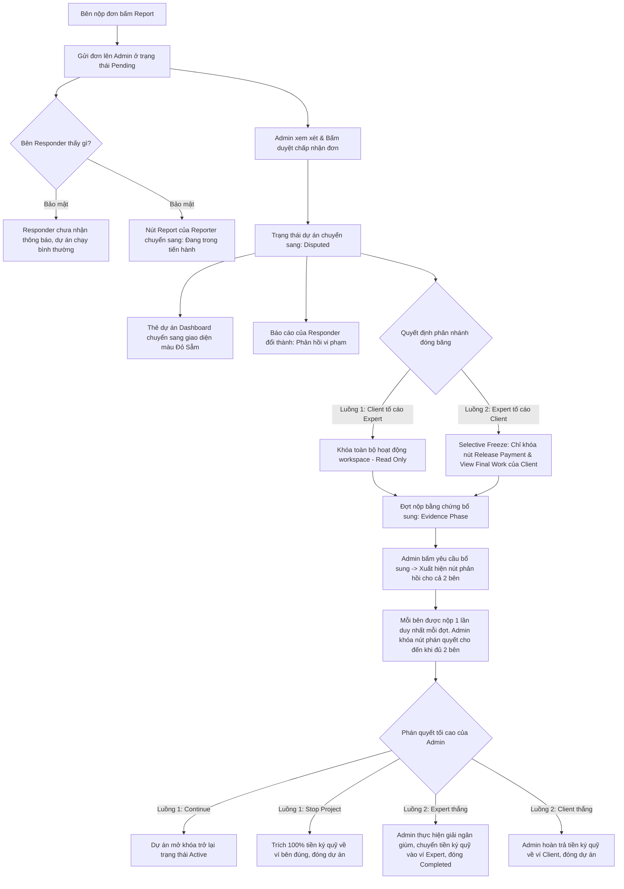

# TÀI LIỆU ĐẶC TẢ HỆ THỐNG NGHIỆP VỤ MỚI: AI-TASKER

Tài liệu này đặc tả toàn bộ luồng nghiệp vụ mới của hệ thống **AI-Tasker** (Freelance Marketplace cho các dự án trí tuệ nhân tạo), định hình lại cơ chế phân rã dự án, quy trình thực thi công việc và giải quyết tranh chấp theo mô hình tối ưu hóa trải nghiệm người dùng và bảo mật dòng tiền ký quỹ.

---

## CHƯƠNG 1: CẤU TRÚC PHÂN RÃ CÔNG VIỆC THEO USE CASE (4 CẤP)

Hệ thống AI-Tasker chuyển dịch toàn diện sang mô hình **Use-Case-Driven**. Mọi hoạt động từ đăng tuyển, đấu thầu, lập tiến độ cho đến thực thi và nghiệm thu đều chạy theo cấu trúc phân cấp nghiêm ngặt sau:

$$\text{Project (Dự án)} \rightarrow \text{Use Cases (Client định nghĩa)} \rightarrow \text{Tasks (Expert phân rã)} \rightarrow \text{MiniTasks (Checklist chi tiết)}$$

1. **Project (Dự án)**: Dự án tổng thể do Client tạo lập dựa trên nhu cầu của doanh nghiệp.
2. **Use Cases (Mục tiêu nghiệp vụ)**: Danh sách các trường hợp sử dụng chuẩn hóa do Client định nghĩa sẵn từ tài liệu yêu cầu. Mỗi Use Case được gán một định danh duy nhất (`UseCase_ID` dạng GUID/Identity).
3. **Tasks (Mốc công việc lớn)**: Các cột mốc kỹ thuật do Expert đề xuất nằm dưới từng Use Case và được liên kết bằng trường `useCaseId` duy nhất (thay vì chỉ mục mảng) để tránh bị lệch dữ liệu khi Client thay đổi/xóa Use Case. Expert không được quyền tự sửa đổi hay xóa Use Case của Client.
4. **MiniTasks (Checklist chi tiết)**: Các đầu việc nhỏ nhất nằm dưới từng Task để Expert thực hiện tích checklist và báo cáo tiến độ công việc hàng ngày.

---

## CHƯƠNG 2: QUY TRÌNH VÒNG ĐỜI DỰ ÁN CHI TIẾT (5 GIAI ĐOẠN)

```mermaid
sequenceDiagram
    autonumber
    actor Client as Client (Khách hàng)
    actor Expert as Expert (Chuyên gia)
    actor Admin as Admin (Quản trị viên)
    participant DB as AITasker DB / System
    participant Escrow as Escrow (Tiền ký quỹ dự án)

    %% Giai đoạn 1
    Note over Client, DB: Giai đoạn 1: Khởi tạo & Phân rã AI
    Client->>DB: Upload BRD/SRS & Đăng JobPost
    DB->>DB: AI quét file, tự động phân rã thành Use Cases & Timeline gốc
    Client->>DB: Cấu hình Deadline tổng (>= Tổng timeline gốc)

    %% Giai đoạn 2
    Note over Client, Expert: Giai đoạn 2: Đấu thầu động & Báo giá
    Expert->>DB: Xem Use Cases gốc, thêm Tasks & MiniTasks bên dưới
    Expert->>DB: Điền ngày hoàn thành & số tiền từng Task (Roll-up)
    alt Độ lệch thời gian Use Case < 0 (vượt quá)
        DB-->>Expert: Cảnh báo đỏ & Yêu cầu xác nhận xin gia hạn
    end
    Expert->>DB: Nộp Proposal
    loop Đếm ngược 7 ngày
        Note over DB: Chạy bộ đếm tự động
        DB-->>Client: Ngày 6: Bắn thông báo khẩn nhắc xử lý đơn
        alt Ngày 7: Client không xử lý
            DB->>DB: Tự động hủy đơn (Đổi sang Expired/Rejected)
        end
    end

    %% Giai đoạn 3
    Note over Client, Escrow: Giai đoạn 3: Tuyển dụng & Ký quỹ
    Client->>DB: Chấp nhận Proposal của Expert
    DB->>Escrow: Ký quỹ thực tế theo Giá và Thời gian do Expert đề xuất
    DB->>DB: Lưu trữ JobPost gốc (Trạng thái Done, khóa ứng tuyển)

    %% Giai đoạn 4
    Note over Client, Expert: Giai đoạn 4: Thực thi & Nghiệm thu Task
    Expert->>DB: Tích 100% MiniTasks (Trạng thái: Checklist Completed)
    alt Luồng 1: Quick Accept
        Client->>DB: Bấm Quick Accept -> Task chuyển DONE
    alt Luồng 2: Yêu cầu sản phẩm
        Client->>DB: Bấm Yêu cầu sản phẩm -> Khóa màn hình Client
        DB-->>Expert: Mở khóa nút Submit Product
        Expert->>DB: Điền Link/File sản phẩm -> Trạng thái: Waiting for Approval
        Client->>DB: View Product -> Xem Modal -> Quyết định
        alt Lựa chọn A: Phê duyệt
            Client->>DB: Bấm Accept -> Task chuyển DONE
        else Lựa chọn B: Từ chối
            Client->>DB: Bấm Decline -> Nhập phản hồi -> Rework (Màu Cam)
            DB-->>Expert: Mở khóa Submit Product để nộp lại sản phẩm mới
        end
    end

    %% Giai đoạn 5
    Note over Client, Escrow: Giai đoạn 5: Nghiệm thu tổng thể & Giải ngân
    Note over Expert, Client: Tất cả Tasks/Use Cases đều đạt trạng thái DONE
    Expert->>DB: Submit Work (Upload Link dự án & File mã nguồn nén)
    DB->>DB: Dự án chuyển sang Final Product Submitted
    Client->>DB: Bấm View Final Work -> Mở Modal thẩm định
    Client->>DB: Bấm Accept Final Delivery inside Modal
    Client->>DB: Bấm Release Payment ngoài màn hình chính
    DB->>Escrow: Giải ngân tiền ký quỹ về Ví khả dụng của Expert
    DB->>DB: Dự án kết thúc thành công (Status: Completed)
```

### GIAI ĐOẠN 1: KHỞI TẠO JOBPOST BẰNG AI VÀ ĐỊNH LƯỢNG USE CASE
- **Đăng bài tuyển dụng (Client)**: Client khi tạo bài đăng tuyển dụng (`JobPost`) có quyền tải lên tệp tài liệu yêu cầu (BRD/SRS). Hệ thống AI tự động quét tệp và phân tách thành danh sách các `Use Cases` chuẩn hóa.
- **Thiết lập thông số gốc**: Mỗi Use Case chứa một danh sách nhiệm vụ/yêu cầu cụ thể và một timeline giới hạn gốc bắt buộc (Ví dụ: Use Case 1 cần hoàn thành tối đa 14 ngày).
- **Quy tắc tính thời gian tổng**:
  - Hệ thống tự động tính:
    $$\text{Tổng thời gian gốc} = \sum \text{Thời gian của các Use Case}$$
  - Client được quyền cấu hình Deadline tổng cho bài đăng `JobPost` với điều kiện kiểm tra nghiêm ngặt:
    $$\text{Deadline tổng} \ge \text{Tổng thời gian gốc}$$

### GIAI ĐOẠN 2: ĐẤU THẦU ĐỘNG (PROPOSAL COUPLING) & ĐẾM NGƯỢC HỦY ĐƠN
1. **Expert phân rã kỹ thuật và Báo giá**:
   - Expert xem bài đăng, lấy cấu trúc Use Case của Client làm tiêu chuẩn bắt buộc (không có quyền chỉnh sửa hay xóa Use Case gốc của Client).
   - Dưới mỗi Use Case, Expert tự phân rã thêm các mốc công việc `Tasks` lớn và các `MiniTasks` (checklist công việc chi tiết).
   - Expert điền số ngày hoàn thành và số tiền tương ứng cho từng đầu việc. Hệ thống tự động cộng dồn (**Roll-up**) để ra tổng ngân sách và tổng thời gian mới của đề xuất.
   - **Logic kiểm tra độ lệch ngân sách và thời gian (Budget & Time Deviation)**:
     - **Độ lệch thời gian**: $\text{Độ lệch} = \text{Thời gian gốc của Client} - \text{Thời gian đề xuất của Expert}$. Nếu < 0, cảnh báo xin gia hạn.
     - **Độ lệch ngân sách**: $\text{Budget Deviation} = \text{Ngân sách gốc của Client} - \text{Tổng tiền đề xuất của Expert}$. 
     - Nếu **Budget Deviation < 0** (vượt ngân sách gốc của Client): Hệ thống hiển thị **banner cảnh báo màu đỏ nổi bật** ghi nhận rõ số tiền lệch `Budget Deviation` (ví dụ: `-$150.00`).
     - Bắt buộc Expert phải tích chọn hộp kiểm xác nhận đồng ý gửi đề xuất vượt chỉ tiêu ngân sách/timeline của khách hàng thì mới được phép nhấn nút nộp đơn (Proposal).
2. **Cơ chế Tự động Hủy và Nhắc nhở Proposal quá hạn (Mốc 7 ngày)**:
   - Hệ thống tự động chạy ngầm bộ đếm thời gian kể từ thời điểm Expert nộp đơn ứng tuyển:
     - **Ngày thứ 6 (Gửi nhắc nhở)**: Nếu Client chưa phản hồi hay xử lý đơn, hệ thống bắn thông báo khẩn cấp tới Client: *"Bạn có đề xuất từ [Tên Expert] sắp quá hạn vào ngày mai. Vui lòng xử lý ngay trước khi hệ thống tự động hủy đơn."*
     - **Ngày thứ 7 (Tự động Hủy)**: Nếu Client vẫn giữ im lặng, trạng thái đơn chuyển thành `expired` (Quá hạn) hoặc `rejected` (Tự động từ chối). Hệ thống hoàn trả hồ sơ để Expert tự do ứng tuyển Job khác.

### GIAI ĐOẠN 3: TUYỂN DỤNG & KÝ QUỸ THEO THÔNG SỐ ĐỀ XUẤT
- **Duyệt đơn**: Client chấp nhận đề xuất (`Proposal`) đã được cấu trúc hóa của Expert.
- **Ký quỹ thực tế**: Toàn bộ ngân sách nạp vào ví ký quỹ (`escrowBalance` / Funds in Escrow) và thời gian thực hiện dự án sẽ lấy chính xác theo thông số **Giá và Thời gian mới do Expert đề xuất** làm căn cứ, thay thế hoàn toàn thông số gốc của Client.
- **Lưu trữ JobPost**: Sau khi ký quỹ thành công, bài đăng gốc của `JobPost` vẫn được giữ lại trong danh sách All Projects của Client dưới trạng thái **Done** (Đã tuyển dụng) nhằm lưu trữ lịch sử hệ thống, đồng thời khóa tính năng ứng tuyển của Job này đối với các Expert khác.

### GIAI ĐOẠN 4: THỰC THI CÔNG VIỆC VÀ NGHIỆM THU TỪNG MỐC (TASK)
Trong không gian làm việc (Workspace), nút gửi duyệt thủ công suông (`Submit for Review`) bị xóa bỏ hoàn toàn. Luồng nghiệm thu chạy khép kín dựa trên bằng chứng sản phẩm và **ràng buộc bằng chứng bàn giao (Evidence Constraint)**:
1. **Expert tích 100% MiniTasks và bắt buộc cung cấp bằng chứng bàn giao** (Git commit SHA, link báo cáo, giải trình...):
   - Khi thỏa mãn cả 2 điều kiện này, Task mới chính thức chuyển thành trạng thái **Checklist Completed** (được hiển thị rõ bằng chứng bàn giao cho cả Expert và Client xem).
   - Nếu Expert chỉ tích 100% milestone nhưng chưa điền/nộp bằng chứng bàn giao, Task vẫn giữ nguyên trạng thái **In Progress** và Client chưa thể phê duyệt hay yêu cầu sản phẩm.
2. **Quy trình Client xử lý**:
   - **Luồng 1 (Tin tưởng tuyệt đối)**: Client bấm nút **Quick Accept** $\rightarrow$ Task chuyển ngay sang trạng thái **DONE** mà không cần nộp file sản phẩm.
   - **Luồng 2 (Kiểm tra sản phẩm bàn giao)**:
     - Client bấm **Yêu cầu sản phẩm (Request Product)** $\rightarrow$ Màn hình Client chuyển sang trạng thái tĩnh: *"Đang chờ Expert nộp sản phẩm..."*.
     - Nút **Submit Product** phía Expert lập tức được mở khóa.
     - Expert điền Link sản phẩm và đính kèm File sản phẩm $\rightarrow$ Trạng thái chuyển thành **Waiting for Approval**.
     - Phía Client thấy nút **Xem sản phẩm (View Product)** sáng lên. Client bấm mở Modal để kiểm tra nội dung bàn giao:
       - **Đồng ý (Lựa chọn A)**: Bấm **Accept** $\rightarrow$ Task chuyển sang trạng thái **DONE**.
       - **Từ chối (Lựa chọn B)**: Bấm **Decline** $\rightarrow$ Hệ thống hiển thị khung gõ lý do từ chối. Client gửi lý do từ chối $\rightarrow$ Trạng thái chuyển thành **REWORK (Màu Cam)**.
3. **Trạng thái Rework (Màu cam)**:
   - Khi bị từ chối, Task của Expert chuyển sang trạng thái Rework hiển thị bằng màu cam nổi bật.
   - Nút **Submit Product** của Expert sáng lên để nộp lại sản phẩm mới sửa đổi.
   - Màn hình Client hiển thị thông báo chờ tĩnh: *"Đang chờ Expert nộp sản phẩm mới..."* mà không có thêm nút bấm thừa nào.

### GIAI ĐOẠN 5: NGHIỆM THU TỔNG THỂ & GIẢI NGÂN (PROJECT RELEASE)
Khi toàn bộ các Use Case và các Task đều đã đạt trạng thái **DONE** (Tiến độ tổng của dự án đạt đúng 100%):
- **Phía Expert (Nộp sản phẩm tổng)**: Màn hình hiển thị khu vực bàn giao cuối cùng. Expert bắt buộc phải bấm nút **Submit Work** để đính kèm Link dự án thực tế và File mã nguồn nén (.zip, .rar). Trạng thái dự án chuyển sang **Final Product Submitted**.
- **Phía Client (Khóa giải ngân nghiêm ngặt)**:
  - Mặc định ban đầu, nút **Release Payment (Giải ngân)** ngoài màn hình chính của Client và nút **Xem sản phẩm tổng (View Final Work)** bị khóa mờ (`disabled`).
  - Khi Expert nộp xong sản phẩm tổng $\rightarrow$ Nút **View Final Work** sáng lên. Client bấm vào để mở Modal xem toàn bộ file/link bàn giao cuối cùng.
  - Client bấm **Accept Final Delivery** bên trong Modal $\rightarrow$ Modal đóng, nút **Release Payment** ngoài màn hình chính chính thức được mở khóa (active).
  - Client bấm **Release Payment** $\rightarrow$ Hệ thống tự động giải phóng tiền ký quỹ về ví khả dụng của Expert và đóng dự án ở trạng thái **Completed**.

---

## CHƯƠNG 3: LUỒNG BÁO CÁO VI PHẠM & XỬ LÝ TRANH CHẤP CHUẨN HÓA (DISPUTE WORKFLOW)



### 1. Chuẩn hóa thông tin đơn gửi Report (Bảo mật thông tin)
Khi một bên nhấn nút **Report** (nằm cạnh nút Manage Project hoặc Update Project trên Dashboard):
- **Thông tin hiển thị công khai**: Họ tên đầy đủ chính xác của Client và Expert, số tiền ký quỹ chính xác (`escrowBalance`), và ngày bắt đầu dự án thực tế (`Start Date`).
- **Ẩn thông tin bảo mật**: Ẩn hoàn toàn trường `Project ID` (tránh lộ mã hệ thống), trạng thái đơn (`Status`), trường `scope of work space` và trường `other` để tối giản và bảo mật.

### 2. Giao diện xem chi tiết của Admin (Dispute Detail View)
- **Report Content**: Hiển thị chi tiết theo cấu trúc dữ liệu bắt buộc: *Report Reason \*, Dispute Type \*, Detailed Description \*, Desired Resolution \*, và các ảnh/file bằng chứng Evidence \**.
- **Parties Involved (Tab tương tác nổi thông minh)**:
  - Hiển thị 2 Tab **Client** và **Expert** với màu sắc nổi bật khi click chọn (Active tabs styled premium).
  - Tab của bên nào gửi đơn tố cáo trước (Reporter) sẽ tự động hiển thị nội dung trước khi trang được tải.
  - Nếu bên còn lại (Responder) chưa phản hồi giải trình vi phạm, nội dung bên tab của họ sẽ để trống kèm ghi chú rõ ràng: *"Responder has not responded yet" (Chưa có báo cáo phản hồi)*.

### 3. Hai luồng rẽ nhánh xử lý Tranh chấp tối cao

#### LUỒNG TRANH CHẤP 1: CLIENT TỐ CÁO EXPERT (Chất lượng / Tiến độ)
- **Khởi tạo**: Client gửi đơn tố cáo. Nút Báo cáo vi phạm (Report) phía Client vẫn luôn hiển thị và khả dụng ở mọi trạng thái để Client có thể nộp bổ sung/cập nhật tố cáo khi cần. Màn hình quản lý của Client **không** bị khóa cứng (readOnly={false} cho ProjectProgressPanel) để Client có thể tiếp tục xem và tương tác với các Use Cases khác bình thường.
- **Hiệu ứng Đóng băng Hệ thống (Workspace Freezing)**:
  - Dự án chuyển trạng thái sang **Disputed**.
  - **Ngoài Dashboard**: Thẻ dự án của cả Client và Expert chuyển sang giao diện màu đỏ sẫm (Crimson-to-Black gradient) cảnh báo.
  - **Bên trong Không gian làm việc**: Xuất hiện banner cảnh báo đỏ trên đầu. Chỉ vô hiệu hóa thao tác có chọn lọc đối với Use Case đang xảy ra yêu cầu/giao dịch bàn giao (`waiting_expert_product`), các phần khác của dự án vẫn xem được bình thường.
- **Cung cấp thêm bằng chứng liên tục & Hạn chót 48 giờ (Dispute Timeout)**:
  - Nếu Admin thấy chưa đủ thông tin phân định, Admin bấm yêu cầu bổ sung $\rightarrow$ Trạng thái chuyển sang `Awaiting Evidence`.
  - Hệ thống hiển thị **banner cảnh báo màu tím nổi bật và đếm ngược thời gian phản hồi (48 giờ)** trên màn hình Admin và các bên.
  - Mỗi bên được nộp bằng chứng **đúng 1 lần duy nhất** cho mỗi đợt yêu cầu.
  - Mặc định, Admin bị khóa tính năng phán quyết cho đến khi cả hai bên đã hoàn tất nộp bằng chứng của đợt đó. Tuy nhiên, **nếu hết hạn 48 giờ** mà một trong hai bên không phản hồi, hệ thống sẽ tự động mở khóa lại các nút phán quyết để Admin đưa ra phán quyết tối cao dựa trên các bằng chứng hiện có.
- **Phán quyết của Admin**:
  - **Hành động Continue (Tiếp tục)**: Dự án mở khóa trở lại trạng thái Active, hai bên tiếp tục làm việc bình thường.
  - **Hành động Stop Project (Dừng dự án)**: Admin xác định bên sai. Hệ thống tự động trích 100% tiền ký quỹ (Funds in Escrow) chuyển thẳng về ví khả dụng của bên đúng, dự án kết thúc.

#### LUỒNG TRANH CHẤP 2: EXPERT TỐ CÁO CLIENT (Tranh chấp về tiền / Giam giữ giải ngân)
- **Khởi tạo**: Expert nộp đơn kiện Client cố tình giam giữ giải ngân tiền dù dự án đã hoàn thành.
- **Cơ chế Đóng băng có chọn lọc (Selective Freeze)**:
  - Dự án **KHÔNG** bị dừng hoạt động hay khóa nút checklist. Các hoạt động thực thi kỹ thuật vẫn tiếp tục bình thường.
  - Hệ thống chỉ khóa cứng tính năng tài chính của Client (Khóa nút **Release Payment** và nút **View Final Work**) nhằm phong tỏa dòng tiền ký quỹ trong Escrow, không cho Client tẩu tán tiền.
- **Phán quyết dòng tiền cuối cùng**: Admin lựa chọn một trong hai bên thắng cuộc dựa trên bằng chứng thu thập được:
  - **Nếu Expert đúng**: Admin thực hiện lệnh tối cao **Giải ngân (Force Payout)**, chuyển toàn bộ tiền ký quỹ sang ví khả dụng của Expert, đóng dự án thành `Completed`.
  - **Nếu Client đúng** (Chứng minh được Expert nộp sản phẩm lỗi hoặc gian lận): Admin thực hiện **Hoàn trả (Force Refund)** tiền ký quỹ về ví Client, đóng dự án.

#### LUỒNG TRANH CHẤP 3: THU HỒI DỰ ÁN CHỦ ĐỘNG (Mutual Cancellation / Termination)
Khi một bên muốn hủy ngang dự án đang thực hiện (Tiến độ hoàn thành $P\%$), dự án chuyển sang trạng thái `Termination Pending`. Admin thẩm định tiến độ thực tế $P\%$ dựa trên số Task/MiniTask ở trạng thái `DONE`. Sau khi phê duyệt hủy (`Approve Termination`), ví ký quỹ ($E$) sẽ được phân chia như sau:

- **Trường hợp A: Client chủ động thu hồi**
  - **Expert nhận**: $(E \times P\%) + (E \times 10\%)$ (tiền đền bù từ Client).
  - **Hệ thống thu (Platform Fee)**: $E \times 5\%$.
  - **Client nhận lại**: $E \times (100\% - P\% - 15\%)$.
  
- **Trường hợp B: Expert chủ động thu hồi**
  - **Client nhận lại**: $E \times (100\% - P\%) + (E \times 10\%)$ (tiền đền bù từ Expert).
  - **Hệ thống thu (Platform Fee)**: $E \times 5\%$.
  - **Expert nhận**: $E \times (P\% - 15\%)$.

#### PHÍ DỊCH VỤ HỆ THỐNG KHI DỰ ÁN HOÀN THÀNH (Success Fee)
Khi dự án kết thúc thành công 100%, hệ thống tự động trích thu phí dịch vụ 5% trước khi chuyển tiền về ví của Expert:
- **Expert nhận**: $\text{escrowBalance} \times 95\%$.
- **Hệ thống thu**: $\text{escrowBalance} \times 5\%$.

---

## CHƯƠNG 4: CƠ CHẾ ĐỒNG BỘ TIẾN ĐỘ & NHẬT KÝ HOẠT ĐỘNG PHÍA EXPERT (MỚI BỔ SUNG)

### 1. Quy trình tích/hủy hoàn thành nhiệm vụ (Check/Uncheck Checklist)
- **Đánh dấu nổi bật (Highlight Completed)**:
  - Khi Expert tích chọn hoàn thành một milestone/task đơn lẻ:
    - Biểu tượng checkbox chuyển sang màu xanh lá cây (`text-green-600`).
    - Thẻ nhiệm vụ tương ứng tự động đổi sang nền xanh lá nhạt (`bg-green-50/40 border-green-200`) để làm dấu trực quan cho Expert biết.
    - Hệ thống tính toán và tự động cập nhật tiến độ Use Case hiện tại cùng tiến độ chung của toàn dự án.
    - Ghi nhận lịch sử hoạt động dạng: `[Expert] hoàn thành...`.
- **Hủy hoàn thành (Bỏ tích - Uncheck)**:
  - Khi Expert click hủy chọn (bỏ tích square):
    - Giao diện checkbox và nền thẻ nhiệm vụ quay về trạng thái bình thường.
    - Tự động ghi nhận hoạt động (Activity Logs) bắt đầu bằng cụm từ **đã thay đổi** để làm rõ hành động sửa đổi (ví dụ: `[Expert] đã thay đổi trạng thái nhiệm vụ: hủy hoàn thành...` hoặc `[Expert] đã thay đổi milestone: hủy hoàn thành...`).
- **Thay đổi tiêu đề (Rename Task)**:
  - Khi Expert đổi tên Task hoặc Milestone, hệ thống lưu hoạt động mô tả chi tiết: `[Expert] đã thay đổi tiêu đề... từ "[Tên cũ]" thành "[Tên mới]"`.

### 2. Cơ chế đồng bộ hai chiều Mock DB & Tự động phục hồi (Self-Healing Sync)
- **Đồng bộ hai chiều (Bi-directional Sync)**: Mọi thay đổi dữ liệu từ đầu việc (như bảng `tasks`) được tự động đồng bộ sang mảng `tasks` nằm trong bảng `projects` để cả Client và Expert đều có chung một nguồn dữ liệu duy nhất khi theo dõi tiến độ.
- **Tự động phục hồi (Self-healing)**: 
  - Hệ thống tự động kiểm tra và sinh định danh độc nhất `UseCase_ID` (dạng `uc-index-projectId-date`) cho tất cả các Use Case trong bảng `projects` và `jobPosts` để đảm bảo liên kết dữ liệu luôn chuẩn xác.
  - Hàm `_getById("tasks", id)` tự động kéo dữ liệu từ mảng `project.tasks` ra bảng `tasks` nếu chưa tồn tại, loại bỏ tình trạng rỗng danh sách nhiệm vụ trên giao diện cập nhật tiến độ của Expert.
  - Bộ lọc tasks tự động liên kết bằng `useCaseId` thay vì index, có cơ chế dự phòng ngược (fallback) về index đối với các dữ liệu cũ để tránh lỗi giao diện.
