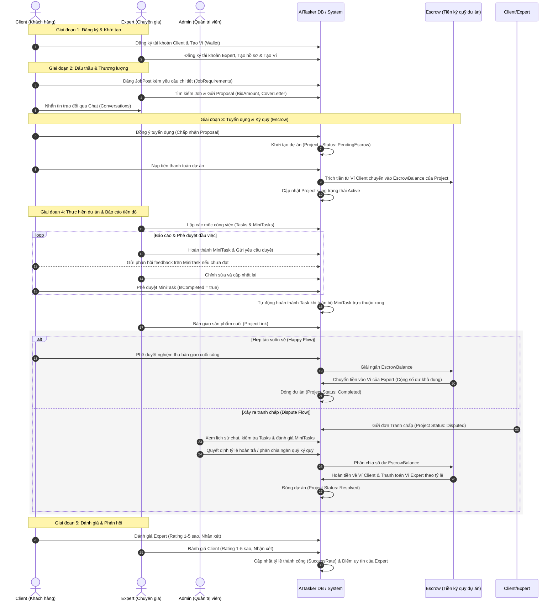
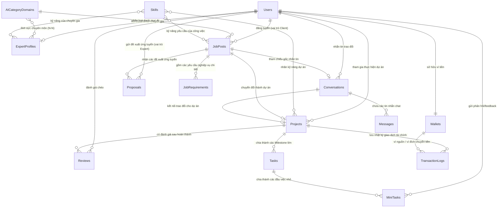

# AI-Tasker: Luồng Nghiệp Vụ & Thiết Kế Cơ Sở Dữ Liệu

Tài liệu này tổng hợp toàn bộ luồng nghiệp vụ tổng thể và thiết kế cơ sở dữ liệu của dự án **AI-Tasker** (Freelance Marketplace cho các giải pháp AI).

---

## 1. Sơ đồ Tuần tự Vòng đời Dự án (Project Lifecycle Sequence Diagram)

Dưới đây là luồng đi chi tiết từ lúc Client đăng tuyển, Expert ứng tuyển, thương lượng, đặt cọc ký quỹ (Escrow), theo dõi tiến độ qua Tasks & MiniTasks, cho đến khi nghiệm thu bàn giao và đánh giá chéo.



---

## 2. Sơ đồ Quan hệ Thực thể Database (Entity Relationship Diagram - ERD)

Mối quan hệ giữa các bảng cơ sở dữ liệu dựa trên schema `DB.sql` của dự án:



---

## 3. Các Luồng Nghiệp Vụ Chi Tiết

### 3.1 Luồng Khởi tạo & Định danh (Onboarding)
- Người dùng khi đăng ký sẽ lựa chọn vai trò:
  - **Client**: Đăng tuyển công việc, thuê chuyên gia, đặt cọc ký quỹ, nghiệm thu sản phẩm.
  - **Expert**: Hoàn thiện hồ sơ (kỹ năng, bằng cấp, mô tả bản thân, mức lương theo giờ), ứng tuyển dự án, thực hiện công việc.
- Hệ thống tự động tạo một Ví (`Wallet`) cho tài khoản mới đăng ký để thực hiện các giao dịch trong hệ thống (số dư ban đầu mặc định $0).

### 3.2 Luồng Tuyển dụng & Thỏa thuận thương lượng
1. **Đăng tin tuyển dụng**: Client đăng tin tuyển dụng (`JobPost`) kèm tiêu đề, mô tả, ngân sách dự kiến, thời hạn hoàn thành, và danh sách các kỹ năng AI cần thiết. Các yêu cầu chi tiết của dự án được lưu vào bảng `JobRequirements`.
2. **Ứng tuyển**: Expert xem tin tuyển dụng và gửi đề xuất (`Proposal`) bao gồm giá thầu (`BidAmount`), thư giới thiệu (`CoverLetter`), cùng **bộ thiết lập kế hoạch tiến độ cấu trúc (nhập liệu 2 cấp gồm các Tasks lớn và Milestones/nhiệm vụ con tương ứng)**.
3. **Thương lượng chat**: Client và Expert trò chuyện trực tuyến qua kênh chat (`Conversations` / `Messages`) để chốt chi tiết công việc.

### 3.3 Luồng Ký quỹ (Escrow Payment) & Khởi Tạo Dự Án
Để đảm bảo an toàn giao dịch cho cả 2 bên và đồng bộ tức thì trên giao diện:
1. **Chấp nhận đề xuất & Tự động Ký quỹ (Luồng Thử Nghiệm / Demo Auth Mode)**: Khi Client bấm nút "Chấp nhận đề xuất" của Expert A ở chế độ Mock DB:
   - Trạng thái đề xuất chuyển thành `"accepted"`, đồng thời toàn bộ các đề xuất của các Expert khác cho công việc này chuyển thành `"rejected"`.
   - Trạng thái JobPost chuyển thành `"hired"` (hoặc `"closed"`).
   - Hệ thống tự động trừ tiền `BidAmount` từ ví khả dụng của Client chuyển vào ví ký quỹ `escrowBalance` / `pendingBalance` của Client.
   - Ghi nhận Transaction Log ký quỹ loại `"escrow_deposit"`.
   - Tự động trích xuất cấu trúc Tasks & Milestones từ CoverLetter (nếu là JSON cấu trúc) hoặc tự động sinh ra các mốc mặc định (nếu là Plain Text) để điền vào dự án.
   - Khởi tạo Project mới ở trạng thái `"active"` với `escrowPaid = true`, `escrowStatus = "paid"`.
   - Bắn sự kiện `"aitasker_db_update"` để đồng bộ UI tức thì.
2. **Nạp tiền Ký quỹ thông qua API (Real API Mode)**:
   - Client nạp tiền ký quỹ qua endpoint `/interactions/transaction` với payload:
     ```json
     {
       "projectId": "guid-project-id",
       "amount": 8500.0,
       "transactionType": "escrow_payment",
       "description": "Client pays full project amount into escrow"
     }
     ```
   - Hệ thống trừ tiền từ ví Client, cập nhật `EscrowBalance` của Project và đổi trạng thái Project sang `"active"`.
3. **Ẩn JobPost đã đóng**: JobPost vừa ký quỹ thành công sẽ ngay lập tức được ẩn đi khỏi trang danh sách "All Projects" của Client và chuyển hoàn toàn thành "Dự án đang chạy" trên Dashboard của cả Client và Expert được thuê nhờ vào cơ chế Custom Event Bus.
4. **Thông báo Ký quỹ đúng đối tượng (Targeted Escrow Notifications)**:
   - Khi có đề xuất mới hoặc cập nhật từ Expert A: Chỉ Client nhận thông báo.
   - Khi ký quỹ thành công: Chỉ Expert được chọn nhận thông báo. Các ứng viên khác không nhận được gì để tránh spam.

### 3.4 Luồng Thực thi dự án (Project Execution & Milestone Progress)
Theo dõi tiến độ dự án trên AI-Tasker được chia thành 2 cấp: **Tasks** (Mốc công việc lớn) và **MiniTasks** (Đầu việc chi tiết con) trong không gian quản trị dự án riêng biệt (`ClientProjectManagement` & `ExpertProjectManagement`):
1. **Tasks**: Các mốc quan trọng lớn (ví dụ: "Thiết kế DB", "Cài đặt Auth").
2. **MiniTasks**: Các mục công việc chi tiết nằm trong từng Task (ví dụ: "Viết script Schema", "Chạy DB Migration").
- **Cơ chế hoạt động & Phối hợp**:
  - **Expert** tích chọn/bỏ chọn trực tiếp các ô MiniTask. Việc thay đổi trạng thái `isCompleted` sẽ tự động kích hoạt cập nhật và phát sự kiện `aitasker_db_update`.
  - **Tự động tính toán tiến độ**:
    - **Tiến độ Task đơn lẻ** = `Số MiniTask đã hoàn thành / Tổng số MiniTask thuộc Task đó` (%).
    - **Tiến độ tổng quan dự án (Overall Progress)** = `Tổng tiến độ của các Task / Tổng số lượng Task` (%).
  - **Tự động tính toán trạng thái hiển thị của Task (`deriveTaskDisplayStatus`)**:
    Trạng thái của từng Task được tính toán tự động dựa trên trạng thái của các MiniTask và tương tác phê duyệt:
    - **Done (Hoàn thành)**: Task đã được Client phê duyệt hoặc hoàn thành, tất cả MiniTask trực thuộc đều đã xong (màu xanh lá).
    - **Decline (Từ chối)**: Client từ chối bàn giao sản phẩm của Task và yêu cầu sửa đổi, tương ứng với trạng thái thô `"needs_revision"` hoặc `"decline"` (màu đỏ).
    - **Waiting For Approval (Chờ phê duyệt)**: Expert đã nộp sản phẩm bàn giao, đang chờ Client kiểm tra và quyết định (màu tím).
    - **Checklist Completed (Đã xong checklist)**: Tiến độ checklist của Task đạt 100% nhưng Expert chưa nộp sản phẩm chính thức (màu cam).
    - **In Progress (Đang thực hiện)**: Có ít nhất một MiniTask được tích hoàn thành hoặc Task có thay đổi tiến độ nhưng chưa nộp sản phẩm.
    - **Not Started (Chưa bắt đầu)**: Chưa có MiniTask nào được hoàn thành và chưa có tiến độ.
  - **Tính năng Chỉnh sửa MiniTask con (Inline Edit - Expert)**:
    - Khi một Task bị Client từ chối (Decline), Expert sẽ thực hiện sửa lỗi trực tiếp trên từng dòng checklist của các MiniTask con (Tiêu đề, Mô tả, Link sản phẩm, Tên file) thay vì sửa ở cấp độ Task lớn.
    - Expert click vào nút "Sửa" trên MiniTask để cập nhật thông tin và nhấn "Lưu".
  - **Khóa nút chống gửi spam**: Khi Task ở trạng thái Chờ phê duyệt (`Waiting For Approval`), cả hai nút "Submit for Review" (nếu có) và "Submit Product" phía Expert đều bị khóa (làm mờ) để tránh tình trạng Expert gửi sản phẩm liên tục khi Client chưa phản hồi.
  - **Đồng bộ thanh tiến độ trên Dashboard**: Chỉ số "Milestone Progress" hiển thị trên thẻ dự án tại Dashboard của cả Client và Expert được đồng bộ trực tiếp và chính xác với "Overall Progress" dựa trên cùng dữ liệu bảng `tasks`.
  - **Đồng bộ thời gian thực**: Mọi thay đổi do Expert cập nhật được phản ánh tức thì trên màn hình Client qua Custom Event Bus.

### 3.5 Luồng Nghiệm thu & Giải ngân (Escrow Payout & Submission)
Quy trình nộp sản phẩm và thanh toán được ràng buộc chặt chẽ bởi tiến độ thực tế và cơ chế xét duyệt nghiêm ngặt:
1. **Nộp và xem sản phẩm nghiệm thu (Phía Client & Expert)**:
   - **Phía Expert**: Nút "Submit for Review" bị loại bỏ hoàn toàn. Expert chỉ sử dụng nút "Submit Product" để nộp file/link sản phẩm. Nút này mặc định bị khóa (làm mờ), chỉ mở khóa khi:
     - Tiến độ checklist của Task đạt 100%.
     - Hoặc Client gửi yêu cầu khẩn cấp ("Request Product"), lúc này cờ `urgentRequest` được bật sang `true`.
     Khi Expert điền Link/File sản phẩm và bấm "Submit Product", Task sẽ chuyển sang trạng thái "Waiting For Approval" (`pending_review`).
   - **Phía Client**:
     - Khi Task đạt tiến độ checklist 100% nhưng chưa nộp sản phẩm, trạng thái hiển thị là **"Checklist Completed"**. Client có 2 lựa chọn hành động:
       - **Quick Accept (Duyệt nhanh)**: Phê duyệt hoàn thành Task ngay lập tức (chuyển sang "Done") mà không cần chờ nộp sản phẩm.
       - **Request Product (Yêu cầu sản phẩm)**: Gửi thông báo yêu cầu Expert nộp sản phẩm bàn giao gấp (bật cờ `urgentRequest` ở phía Expert và mở khóa nút "Submit Product" cho Expert).
     - Khi Task ở trạng thái **"Waiting For Approval"**: Client thấy nút **"Xem sản phẩm" (View Product)** hiển thị trực tiếp. Khi click vào nút này, hệ thống sẽ mở ra một modal hiển thị liên kết và file sản phẩm của Task đó (không kèm danh sách MiniTasks con để tránh rối mắt). Trong modal có 2 nút hành động chính:
       - **Accept (Phê duyệt)**: Xác nhận sản phẩm đạt chất lượng, đóng modal và chuyển Task thành "Done".
       - **Decline (Từ chối)**: Đóng modal xem sản phẩm, đồng thời mở khóa nút "Decline" ngoài giao diện và tự động hiển thị khung nhập lý do từ chối (feedback textarea) phía dưới dòng Task. Client nhập lý do và bấm gửi để chuyển Task sang trạng thái "Decline" (raw status: `"needs_revision"`).
2. **Bàn giao và Giải ngân dự án (Release Payment & Project Final Handover)**:
   - **Phía Expert (Bàn giao sản phẩm tổng)**: Khi toàn bộ các Task của dự án được Client duyệt hoàn thành (Tiến độ tổng đạt 100%), không gian làm việc của Expert sẽ hiển thị khu vực **Bàn giao dự án tổng thể**. Expert không thể kết thúc dự án nếu không bấm nút **Submit Work (Nộp sản phẩm tổng thể)**. Khi click, một popup mở ra yêu cầu cung cấp:
     - **Project Link**: Đường dẫn deploy thực tế hoặc link repository chính thức.
     - **Project Files**: Tệp nén (.zip, .rar) chứa mã nguồn, tài liệu hướng dẫn vận hành hoặc báo cáo.
     Sau khi gửi thành công, hệ thống gửi thông báo khẩn tới Client và chuyển trạng thái bàn giao của dự án sang `"Final Product Submitted"` (Đã nộp sản phẩm tổng).
   - **Phía Client (Thẩm định & Giải ngân theo thứ tự nghiêm ngặt)**:
     - **Bước 1: Trạng thái chờ và Nút giải ngân bị khóa**: Mặc định, nút **Release Payment (Giải ngân)** trên màn hình chính của Client ở trạng thái khóa mờ (`disabled`). Nút **Xem sản phẩm tổng (View Final Work)** bên cạnh cũng bị khóa mờ nếu Expert chưa thực hiện bước nộp sản phẩm tổng.
     - **Bước 2: Thẩm định sản phẩm tổng (View Final Work)**: Khi Expert đã nộp sản phẩm tổng thành công, nút **Xem sản phẩm tổng (View Final Work)** bên phía Client sẽ sáng lên (active). Client bấm vào để mở modal kiểm tra Link/File bàn giao. Trong modal này, Client có hành động:
       - **Accept Final Delivery (Chấp nhận sản phẩm tổng)**: Đóng modal, chuyển trạng thái bàn giao sang `"Accepted"` và mở khóa (active) nút **Release Payment** ngoài màn hình chính.
       - **Từ chối (Decline)**: Mở khung nhập lý do từ chối sản phẩm tổng để gửi phản hồi và ép Expert nộp lại qua nút **Submit Work**.
     - **Bước 3: Giải ngân và Đóng dự án**: Khi Client bấm nút **Release Payment** ngoài màn hình chính (sau khi đã được mở khóa), popup xác nhận hiển thị: *"Bạn có chắc chắn muốn giải ngân cho dự án [Tên dự án]?"*. Khi đồng ý, hệ thống gọi API `/interactions/transaction` với loại `release_payment`:
       - Trích toàn bộ tiền ký quỹ (`escrowBalance`) của dự án chuyển thẳng vào Ví khả dụng (`balance`) và Doanh thu tích lũy (`totalEarned`) của Expert.
       - Đổi trạng thái dự án thành `Completed` (Hoàn thành) và trạng thái tin tuyển dụng tương ứng thành `completed`.
       - Mở màn hình Đánh giá & Phản hồi chéo (Reviews) cho cả hai bên.

3. **Đánh giá**: Client và Expert thực hiện đánh giá chéo (`Reviews`). Hệ thống tự động tính toán lại tỷ lệ hoàn thành dự án (`SuccessRate`) và điểm uy tín (`ReputationCredit`) cho Expert dựa trên điểm rating vừa nhận.

### 3.6 Luồng Giải quyết Tranh chấp (Dispute Resolution)
1. Khi xảy ra mâu thuẫn (Ví dụ: Expert không làm việc hoặc Client không duyệt bài dù đã làm xong), một trong hai bên có thể nhấn nút "Yêu cầu Tranh chấp".
2. Trạng thái dự án chuyển thành `Disputed`, tiền ký quỹ bị đóng băng.
3. Admin truy cập trang Quản lý Tranh chấp (`AdminDisputes`), xem lịch sử chat và kiểm duyệt nhật ký hoàn thành của các `Tasks` / `MiniTasks` (cũng như các feedback Client đã gửi).
4. Admin đưa ra phán quyết chia tiền ký quỹ thông qua API `/interactions/transaction` với loại `"dispute_refund"`:
   - Hoàn trả một phần hoặc toàn bộ tiền ký quỹ về Ví Client và chuyển phần còn lại về Ví Expert.
5. Hệ thống giải ngân tiền ký quỹ theo tỷ lệ của Admin về ví của hai bên và chuyển trạng thái dự án thành `Resolved`.

### 3.7 Hệ thống Thông báo Toàn diện (Targeted Notifications System)
Mọi thay đổi trạng thái quan trọng trong vòng đời dự án đều kích hoạt gửi thông báo tự động thông qua `notificationHelper.js` đến đúng đối tượng thụ hưởng:
- **Luồng Đấu thầu (Proposal Triggers)**:
  - **Đề xuất mới (`notifyNewProposal`)**: Gửi tới Client chủ JobPost khi Expert nộp hồ sơ.
  - **Cập nhật đề xuất (`notifyUpdatedProposal`)**: Gửi tới Client khi Expert sửa đổi đề xuất theo yêu cầu.
  - **Quyết định đề xuất (`notifyProposalDecision`)**: Gửi thông báo chúc mừng tới Expert được chọn; gửi thông báo từ chối tới các Expert không được chọn.
  - **Ký quỹ thành công (`notifyEscrowFunded`)**: Gửi tới duy nhất Expert được chọn để báo hiệu dự án bắt đầu.
- **Luồng Công việc & Nhiệm vụ (Task & MiniTask Triggers)**:
  - **Nộp duyệt Task (`notifyTaskSubmittedForReview`)**: Gửi tới Client khi Expert hoàn thành toàn bộ MiniTask của một Task và yêu cầu nghiệm thu.
  - **Phê duyệt Task (`notifyTaskApproved`)**: Gửi tới Expert khi Client bấm duyệt Task.
  - **Yêu cầu sửa đổi Task (`notifyTaskRevisionRequested`)**: Gửi tới Expert kèm nội dung phản hồi (feedback) chi tiết của Client.
  - **Yêu cầu sửa đổi MiniTask (`notifyMiniTaskRevisionRequested`)**: Gửi tới Expert khi Client chỉ ra cụ thể các đầu việc nhỏ cần sửa đổi kèm theo lý do.
  - **Task quá hạn (`notifyTaskOverdue`)**: Gửi tới cả Client và Expert để cảnh báo khi mốc thời gian hoàn thành Task đã trôi qua mà chưa xong.
  - **Yêu cầu khẩn cấp (`notifyUrgentSubmissionRequested`)**: Gửi tới Expert khi Client bấm nút yêu cầu hoàn thành gấp một đầu việc đang bị trễ.

### 3.8 Cơ chế Đồng bộ Real-time qua Custom Event Bus
Hệ thống sử dụng Custom Event Bus của trình duyệt để đạt hiệu ứng cập nhật dữ liệu tức thì (Real-time UI updates) mà không cần tải lại trang (reload):
1. Mỗi khi Mock DB hoặc Mock API có sự thay đổi dữ liệu (tạo dự án, cập nhật đề xuất, thay đổi trạng thái MiniTask, giải ngân), hệ thống sẽ phát đi sự kiện:
   ```javascript
   window.dispatchEvent(new CustomEvent("aitasker_db_update"));
   ```
2. Các React Component (như `ClientDashboard`, `ExpertDashboard`, `MyProjectsList`, `ProjectDetail`, `ExpertProjectDetail`) đăng ký lắng nghe sự kiện này trong hook `useEffect` và tự động thực hiện gọi lại hàm nạp dữ liệu (silent re-fetch) trong nền để cập nhật React state cục bộ, giúp giao diện người dùng luôn hiển thị thông tin mới nhất.

---

## 4. Tóm tắt Các Thay Đổi & Cải Tiến UI/UX Gần Đây (Cập Nhật 24/06/2026)

Để tối ưu hóa trải nghiệm người dùng, hệ thống đã được nâng cấp đồng bộ các tính năng sau:

### 4.1 Phía Client (Khách hàng)
- **Tối giản hóa giao diện**: Xóa bỏ hoàn toàn nút "View Detail" tại danh sách quản lý dự án (`ClientDashboard`, `MyProjectsPage.jsx`). Client không cần thao tác qua nhiều tầng giao diện.
- **Bỏ cơ chế duyệt thủ công từng mốc nhỏ lẻ**: Xóa bỏ nút "Accept" độc lập cho từng Task lớn. Quy trình duyệt sản phẩm bàn giao được tập trung vào luồng nghiệm thu Milestone.
- **Thanh điều khiển tinh gọn (Chỉ hiển thị khi Task ở trạng thái Chờ phê duyệt - `Waiting For Approval`)**:
  - **Nút "Xem sản phẩm" (View Product)**: Mở modal hiển thị trực tiếp nội dung File hoặc Link sản phẩm do Expert nộp cho Task đó (không chứa danh sách MiniTasks để tránh rối mắt).
  - **Nút "Decline" (Từ chối)**: Đưa ra ngoài cạnh nút xem sản phẩm.
- **Cơ chế khóa và mở khóa nút động**:
  - Nếu Expert **đã nộp** sản phẩm: Nút "Decline" ngoài giao diện mặc định bị khóa (`disabled`). Client buộc phải nhấn "Xem sản phẩm" để xem chi tiết sản phẩm. Trong modal xem sản phẩm có 2 nút: **Accept** (duyệt hoàn thành Task) và **Decline** (từ chối). Khi Client click "Decline" trong modal, modal đóng lại, đồng thời nút "Decline" bên ngoài sẽ được mở khóa và hiển thị khung nhập lý do từ chối (feedback textarea) phía dưới để Client gửi phản hồi.
  - Nếu Expert **chưa nộp** sản phẩm: Nút "Xem sản phẩm" bị khóa, nút "Decline" bên ngoài mở trực tiếp cho phép Client từ chối và ghi phản hồi ngay lập tức.
  - Nếu Task **chưa hoàn thành** (tiến độ dưới 100% hoặc chưa gửi duyệt): Cả hai nút "Xem sản phẩm" và "Decline" đều ẩn.

### 4.2 Phía Expert (Chuyên gia)
- **Cơ chế khóa nút chống spam**: Khi Task ở trạng thái Chờ phê duyệt (`pending_review`), cả hai nút "Submit for Review" và "Submit Product" đều bị làm mờ (`disabled`) nhằm ngăn Expert bấm gửi liên tiếp.
- **Chỉnh sửa trực quan (Inline Edit) cho MiniTask**: Khi Task bị Client từ chối (Decline), Expert thực hiện chỉnh sửa nội dung/sửa lỗi trực tiếp trên từng dòng check-list MiniTask con (Tiêu đề, Mô tả, Link sản phẩm, Tên file) thay vì chỉnh sửa ở mức Task lớn.
- **Khung phản hồi từ chối (Decline Feedbacks Panel)**: Hiển thị ngay trung tâm giao diện quản lý để Expert dễ dàng theo dõi lý do Client yêu cầu chỉnh sửa.

### 4.3 Đồng bộ Tiến độ Dashboard & Giải ngân Escrow
- **Đồng bộ tiến độ thẻ dự án**: Chỉ số "Milestone Progress" hiển thị trên Dashboard của cả Client và Expert được tính toán trực tiếp từ cơ sở dữ liệu `tasks` hoạt động thực tế, khớp hoàn toàn 100% với tiến độ chi tiết hiển thị bên trong dự án.
- **Quy trình Giải ngân tự động (Release Payment)**:
  - Khi tiến độ dự án đạt **đúng 100%** (tất cả các Task đều ở trạng thái Done), Client sẽ thấy nút "Release Payment" xuất hiện.
  - Bấm nút này sẽ mở popup xác nhận giải ngân. Khi đồng ý, hệ thống tự động giải phóng toàn bộ số dư ký quỹ (`escrowBalance`) của dự án, chuyển trực tiếp vào số dư khả dụng (`balance`) và tổng thu nhập (`totalEarned`) của Expert, đồng thời đưa dự án về trạng thái hoàn thành (`completed`) và đồng bộ real-time giao diện qua Event Bus.


