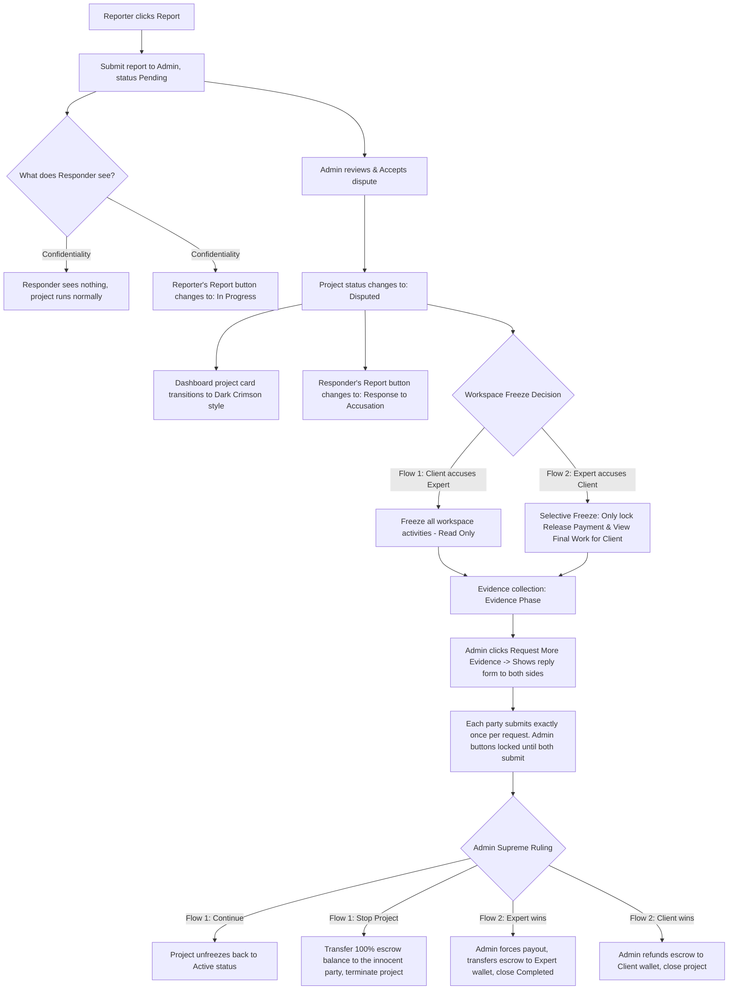

# NEW SPECIFICATION SYSTEM SPECIFICATION DOCUMENT: AI-TASKER

This document specifies the complete new business flow for the **AI-Tasker** platform (a freelance marketplace for artificial intelligence solutions), reshaping project decomposition, project execution workflows, and dispute resolution to optimize the user experience and secure escrow funds.

---

## CHAPTER 1: WORK BREAKDOWN STRUCTURE (WBS) BY USE CASE (4 LEVELS)

The AI-Tasker system transitions entirely to a **Use-Case-Driven** model. All operations from job posting, bidding, and scheduling to execution and acceptance run under the following strict hierarchical structure:

$$\text{Project} \rightarrow \text{Use Cases (Defined by Client)} \rightarrow \text{Tasks (Decomposed by Expert)} \rightarrow \text{MiniTasks (Detailed Checklist)}$$

1. **Project**: The overall project created by the Client based on business needs.
2. **Use Cases**: The list of standardized use cases defined by the Client from requirements documents. Each Use Case is assigned a unique `UseCase_ID` (GUID/Identity).
3. **Tasks**: Technical milestones proposed by the Expert under each Use Case, linked dynamically via `useCaseId` (instead of array index) to prevent data mismatch when Client modifies Use Cases. Experts cannot modify or delete Client's original Use Cases.
4. **MiniTasks**: The smallest checklist units under each Task for the Expert to check off and report daily progress.

---

## CHAPTER 2: DETAILED PROJECT LIFECYCLE (5 PHASES)

```mermaid
sequenceDiagram
    autonumber
    actor Client as Client
    actor Expert as Expert
    actor Admin as Admin
    participant DB as AITasker DB / System
    participant Escrow as Escrow (Project Funds)

    %% Phase 1
    Note over Client, DB: Phase 1: AI Initialization & WBS
    Client->>DB: Upload BRD/SRS & Post Job
    DB->>DB: AI scans file, auto-decomposes into Use Cases & Original Timeline
    Client->>DB: Configure Total Deadline (>= Total original timeline)

    %% Phase 2
    Note over Client, Expert: Phase 2: Dynamic Bidding & Pricing
    Expert->>DB: View original Use Cases, add Tasks & MiniTasks under them
    Expert->>DB: Fill completion days & price for each Task (Roll-up)
    alt Use Case Time Deviation < 0 (exceeded limit)
        DB-->>Expert: Red alert & ask for confirmation to request Client extension
    end
    Expert->>DB: Submit Proposal
    loop 7-day Countdown
        Note over DB: Auto-timer background execution
        DB-->>Client: Day 6: Dispatch urgent reminder to process proposal
        alt Day 7: Client has not processed
            DB->>DB: Auto-cancel proposal (Set status to Expired/Rejected)
        end
    end

    %% Phase 3
    Note over Client, Escrow: Phase 3: Hiring & Escrow
    Client->>DB: Accept Expert's Proposal
    DB->>Escrow: Fund escrow using Price & Time proposed by Expert
    DB->>DB: Archive original JobPost (Status: Done, block new applications)

    %% Phase 4
    Note over Client, Expert: Phase 4: Execution & Milestone Acceptance
    Expert->>DB: Mark 100% MiniTasks completed (Status: Checklist Completed)
    alt Flow 1: Quick Accept
        Client->>DB: Click Quick Accept -> Task becomes DONE
    alt Flow 2: Product Requested
        Client->>DB: Click Request Product -> Wait state on Client UI
        DB-->>Expert: Unlock Submit Product button
        Expert->>DB: Fill Product Link/File -> Status: Waiting for Approval
        Client->>DB: View Product -> Open Modal -> Verification
        alt Choice A: Accept
            Client->>DB: Click Accept -> Task becomes DONE
        else Choice B: Decline
            Client->>DB: Click Decline -> Enter feedback -> REWORK (Orange status)
            DB-->>Expert: Unlock Submit Product to re-submit new work
        end
    end

    %% Phase 5
    Note over Client, Escrow: Phase 5: Final Delivery & Release Payment
    Note over Expert, Client: All Tasks/Use Cases reach DONE status
    Expert->>DB: Submit Work (Upload Project Link & compressed source code archive)
    DB->>DB: Project changes status to Final Product Submitted
    Client->>DB: Click View Final Work -> Open verification modal
    Client->>DB: Click Accept Final Delivery inside modal
    Client->>DB: Click Release Payment on dashboard
    DB->>Escrow: Release EscrowBalance to Expert's Available Balance
    DB->>DB: Project closed successfully (Status: Completed)
```

### PHASE 1: JOBPOST INITIALIZATION BY AI AND USE CASE METRICS
- **Posting a Job (Client)**: When creating a job posting (`JobPost`), the Client can upload a requirements document (BRD/SRS). The system's AI automatically scans the file and decomposes it into a list of standardized `Use Cases`.
- **Set Original Parameters**: Each Use Case contains a list of specific tasks/requirements and a mandatory original timeline limit (e.g., Use Case 1 needs at most 14 days).
- **Total Time Calculation Rule**:
  - The system automatically calculates:
    $$\text{Total Original Time} = \sum \text{Time of each Use Case}$$
  - The Client can configure a Total Deadline for the `JobPost` under the strict validation rule:
    $$\text{Total Deadline} \ge \text{Total Original Time}$$

### PHASE 2: DYNAMIC BIDDING (PROPOSAL COUPLING) & 7-DAY EXPIRATION COUNTDOWN
1. **Expert Technical Analysis & Bidding**:
   - The Expert views the job posting, using the Client's Use Cases as the mandatory standard (no permission to edit or delete the Client's original Use Cases).
   - Under each Use Case, the Expert adds technical `Tasks` (milestones) and `MiniTasks` (detailed checklists).
   - The Expert enters completion days and price for each Task. The system automatically rolls up (**Roll-up**) these values to calculate the total bid price and total bid timeline.
    - **Validation Checks (Budget & Time Deviation)**:
      - **Time Deviation**: $\text{Deviation} = \text{Client Original Duration} - \text{Expert Proposed Duration}$. If < 0, triggers request for timeline extension.
      - **Budget Deviation**: $\text{Budget Deviation} = \text{Client Original Budget} - \text{Expert Proposed Bid}$.
      - If **Budget Deviation < 0** (Expert's bid exceeds Client's original budget): The system displays a **prominent red warning banner** showing the exact deviation amount (e.g. `-$150.00`).
      - The Expert must check a confirmation checkbox at the bottom of the proposal page to acknowledge and agree to submit a proposal exceeding the client's targets before the submit button is unlocked.
2. **Auto-Cancellation and Reminders for Overdue Proposals (7-day mark)**:
   - The system runs an automated background timer starting from the proposal submission time:
     - **Day 6 (Reminder)**: If the Client has not processed the proposal, the system sends an urgent notification: *"You have a proposal from [Expert Name] expiring tomorrow. Please process it immediately before the system auto-cancels it."*
     - **Day 7 (Auto-Cancel)**: If the Client remains silent, the proposal status shifts to `expired` or `rejected`. The application is returned, allowing the Expert to apply to other jobs.

### PHASE 3: RECRUITMENT & ESCROW ACCORDING TO PROPOSED PARAMS
- **Accept Proposal**: The Client accepts the Expert's structured `Proposal`.
- **Actual Escrow Funding**: The total amount deposited into the escrow account (`escrowBalance` / Funds in Escrow) and the project timeline are determined **EXACTLY by the Price and Timeline proposed by the Expert**, replacing the Client's original configurations.
- **Archive JobPost**: After successful escrow funding, the original `JobPost` remains in the Client's All Projects list with the status **Done** (Hired) to store history, and application features are locked for all other Experts.

### PHASE 4: WORK EXECUTION & MILESTONE (TASK) ACCEPTANCE
In the workspace, the manual "Submit for Review" button without evidence is entirely removed. The acceptance flow is completely evidence-driven and subject to an **Evidence Constraint**:
1. **Expert checks off 100% of MiniTasks AND provides handover evidence** (Git commit SHA, report link, short explanation):
   - Only when both conditions are met, the Task transitions to the **Checklist Completed** status.
   - If milestones are 100% checked but evidence has not been submitted, the Task remains in the **In Progress** status, and Client verification options are not available.
2. **Client Processing Options**:
   - **Flow 1 (Quick Accept)**: The Client clicks the **Quick Accept** button $\rightarrow$ The Task instantly transitions to **DONE** without requiring file uploads.
   - **Flow 2 (Inspect Deliverables)**:
     - The Client clicks **Request Product** $\rightarrow$ The Client's screen shifts to a static message: *"Waiting for Expert to submit product..."*.
     - The **Submit Product** button unlocks on the Expert's side.
     - The Expert fills in the Product Link and attaches the Product File $\rightarrow$ Status changes to **Waiting for Approval**.
     - On the Client's side, the **View Product** button lights up. Clicking it opens a Modal to inspect the work:
       - **Accept (Choice A)**: Click **Accept** $\rightarrow$ Task status transitions to **DONE**.
       - **Decline (Choice B)**: Click **Decline** $\rightarrow$ Displays a textarea to write decline feedback. Once submitted, the Task transitions to **REWORK (Orange color)**.
3. **Rework Status (Orange color)**:
   - When declined, the Expert's Task changes to the Rework status, styled in orange.
   - The **Submit Product** button unlocks on the Expert's side to submit updated deliverables.
   - The Client's screen displays a static waiting status message: *"Waiting for Expert to submit new product..."* with no redundant buttons.

### PHASE 5: OVERALL ACCEPTANCE & RELEASE PAYMENT (PROJECT RELEASE)
Once all Use Cases and Tasks reach the **DONE** status (overall project progress is exactly 100%):
- **Expert Side (Final Handover)**: The workspace displays the final handover section. The Expert must click **Submit Work** to attach the deployed project link and the compressed source code archive (.zip, .rar). The project status shifts to **Final Product Submitted**.
- **Client Side (Strict Payout Lock)**:
  - Initially, the outer **Release Payment** and **View Final Work** buttons are disabled.
  - Once the Expert submits $\rightarrow$ The **View Final Work** button is enabled. The Client clicks it to open the Modal to inspect the final deliverables.
  - Inside the Modal, the Client clicks **Accept Final Delivery** $\rightarrow$ The Modal closes, and the outer **Release Payment** button is enabled (active).
  - Clicking **Release Payment** $\rightarrow$ The system transfers the escrow balance into the Expert's Available Balance and closes the project as **Completed**.

---

## CHAPTER 3: STANDARDIZED REPORT & DISPUTE WORKFLOW



### 1. Standardized Report Form Information (Confidentiality)
When a party clicks **Report** (next to the Manage Project or Update Project button on the Dashboard):
- **Publicly Shown Info**: Correct Full Names of Client and Expert, exact escrow balance (`escrowBalance`), and actual project start date (`Start Date`).
- **Hidden Confidential Info**: The `Project ID` (to prevent exposing system identifiers), the raw ticket status (`Status`), the `scope of work space` field, and the `other` field are entirely removed.

### 2. Admin Dispute Detail View
- **Report Content**: Displays information according to the mandatory structure: *Report Reason \*, Dispute Type \*, Detailed Description \*, Desired Resolution \*, and Evidence \* files*.
- **Parties Involved (Smart Interactive Tabs)**:
  - Displays **Client** and **Expert** tabs with premium active colors.
  - The tab of the party who raised the dispute first (Reporter) is selected by default when the page loads.
  - If the other party (Responder) has not yet submitted their counter-response, their tab displays a clean blank state with the message: *"Responder has not responded yet"*.

### 3. Dual Dispute Paths and Resolution

#### PATH 1: CLIENT ACCUSES EXPERT (Quality / Deadline Dispute)
- **Initialization**: Client submits the report. The Client's Report button remains always visible and interactive across all project states to allow submission updates. The Client's management workspace **is not** frozen globally (`readOnly={false}` passed to `ProjectProgressPanel`), allowing Client to inspect progress and interact with other Use Cases normally.
- **Workspace Freezing**:
  - The project status shifts to **Disputed**.
  - **On the Dashboard**: Project cards on both Client and Expert dashboards display a dark crimson theme (Crimson-to-Black gradient) with a prominent border.
  - **Inside the Workspace**: A red warning banner is displayed at the top. The interface only disables interaction selectively for the specific Use Case undergoing product handover transactions (`waiting_expert_product`); other Use Cases remain interactive.
- **Ongoing Evidence Submissions & 48-hour Countdown (Dispute Timeout)**:
  - If the Admin requires more information, they trigger a request $\rightarrow$ Status changes to `Awaiting Evidence`.
  - The system displays a **prominent purple warning banner with a 48-hour countdown timer** on the Admin view and user screens.
  - Both parties see a prompt to submit further evidence. Each side can submit **exactly once** per request round.
  - Initially, the Admin's ruling buttons are locked until both sides submit. However, **if the 48-hour response deadline expires**, the system automatically unlocks the ruling buttons, allowing the Admin to issue a final judgment based on available evidence.
- **Admin Ruling Options**:
  - **Continue**: The project is unfrozen, returning to `Active` state for both parties to resume work.
  - **Stop Project**: The Admin determines the fault. 100% of the escrow balance (Funds in Escrow) is automatically transferred to the innocent party's wallet, and the project is terminated.

#### PATH 2: EXPERT ACCUSES CLIENT (Payment / Unreleased Escrow Dispute)
- **Initialization**: Expert submits a claim asserting that the Client is withholding payment despite project completion.
- **Selective Freezing**:
  - The project **is not** stopped, and checklist items remain active. Technical execution can continue.
  - Only the Client's financial buttons (**Release Payment** and **View Final Work**) are locked to freeze the escrow funds.
- **Cash Flow Decision**: The Admin decides the winning party:
  - **Expert Wins**: Admin triggers **Force Payout**, releasing escrow funds to the Expert's Available Balance, closing the project as `Completed`.
  - **Client Wins** (Expert submitted fraudulent or faulty work): Admin triggers **Force Refund**, returning escrow funds to the Client's wallet, terminating the project.

### 4. PATH 3: PROJECT TERMINATION & LIQUIDATION RULES (NEW)
When either party requests a project revocation/termination mid-way, the project transitions to "Termination Pending" status. Admin reviews the current progress ($P\%$) based on DONE tasks. Once verified, the Escrow Balance ($E$) is liquidated using the following strict cash flow formulas:

#### SCENARIO A: CLIENT INITIATES TERMINATION
- **Expert Receives**: Progress payment + 10% penalty compensated by Client.
  $$\text{Expert Payout} = (E \times P\%) + (E \times 10\%)$$
- **System Platform Fee**: 5% of total escrow billed to Client.
  $$\text{Platform Fee} = E \times 5\%$$
- **Client Refund**: Remaining balance after deducting Expert payout and System fee.
  $$\text{Client Refund} = E \times (100\% - P\% - 15\%)$$

#### SCENARIO B: EXPERT INITIATES TERMINATION
- **Client Receives**: Unfinished progress balance + 10% penalty compensated by Expert.
  $$\text{Client Refund} = E \times (100\% - P\%) + (E \times 10\%)$$
- **System Platform Fee**: 5% of total escrow billed to Expert.
  $$\text{Platform Fee} = E \times 5\%$$
- **Expert Payout**: Remaining balance after penalties.
  $$\text{Expert Payout} = E \times (P\% - 15\%)$$

### 5. SUCCESSFUL PROJECT COMPLETED PLATFORM FEE
In Phase 5 (Overall Acceptance & Release Payment), upon successful project completion (100% progress), the system automatically deducts a 5% platform service fee before releasing funds to the Expert:
$$\text{Final Expert Payout} = \text{escrowBalance} \times 95\%$$
$$\text{System Revenue Wallet} = \text{escrowBalance} \times 5\%$$

---

### CHAPTER 4: TECHNICAL DATA INTEGRITY (USECASE_ID MAPPING)
To ensure absolute mapping integrity, the database and API layer dynamically assign unique `UseCase_ID` (such as `uc-index-projectId-date`) keys to each Use Case. All tasks are linked to their parent Use Case using `useCaseId` rather than a transient array index. If the Client reorders or deletes a Use Case, the Expert's tasks remain securely mapped to their correct, original Use Case without causing interface misalignment.
