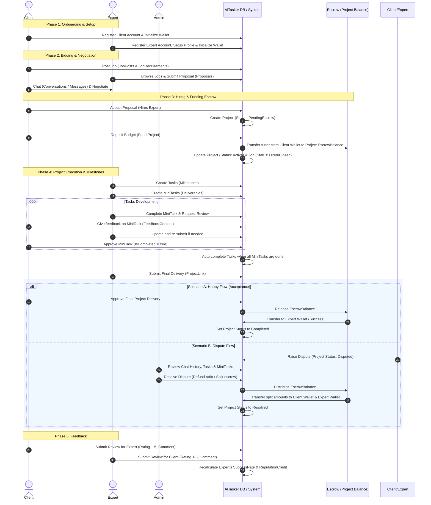
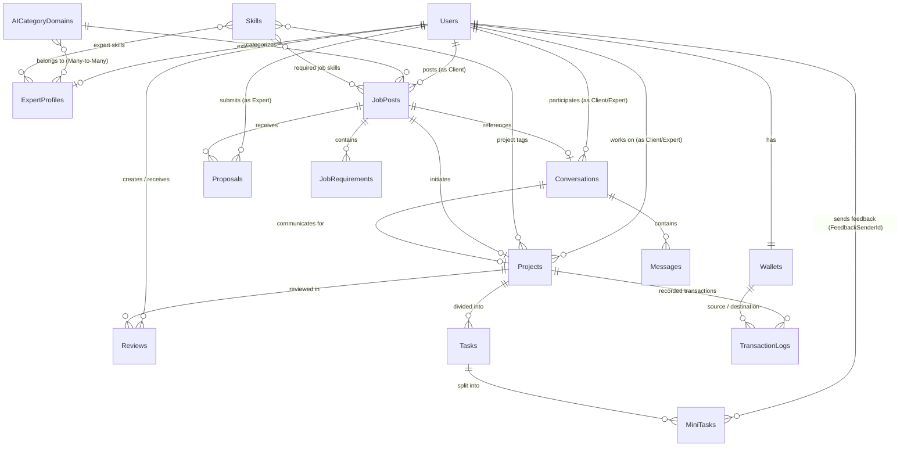

# AI-Tasker: Overall System Flow & Database Architecture

This document provides a comprehensive overview of the **AI-Tasker** freelance marketplace platform, covering its database schema, overall lifecycle flow, role-based workflows, and transition details.

---

## 1. System Flowchart (Project Lifecycle)

The diagram below illustrates the complete lifecycle of a project on AI-Tasker, from user signup and job posting to escrow payment, task execution, dispute resolution, and review feedback.



---

## 2. Database Entity Relationship (ER) Diagram

Based on `DB.sql`, the database architecture forms a solid foundation tracking users, wallets, job details, proposals, active projects, tasks, communication, and transaction logs.



---

## 3. Comprehensive Workflow Explanations

### 3.1 Onboarding & Authentication Flow
- **Roles**:
  - `client`: Posts jobs, hires experts, funds escrow, manages deliverables, reviews experts.
  - `expert`: Updates profile (skills, portfolio, bio), submits proposals, manages tasks, submits code/links, reviews clients.
  - `admin`: Moderates categories, tags, projects, reviews, disputes.
  - `owner`: Inherits admin powers + creates and manages admin accounts.
- **Wallet Setup**: Upon successful registration, the backend creates a `Wallet` record for the user initialized with a `$0.00` balance.

### 3.2 Bidding & Negotiation Flow
1. **Posting a Job**: A `client` posts a `JobPost` specifying:
   - Category (`AICategoryDomainId`), title, description, budget, and deadline.
   - Distinct requirements (`JobRequirements`) representing feature use cases.
   - Mandated skills (`Skills`).
2. **Applying**: An `expert` submits a `Proposal` including their bid price (`BidAmount`), a `CoverLetter`, and **a structured 2-level milestone timeline (Tasks and sub-milestones)**.
3. **Chatting**: The `client` and `expert` initiate a `Conversation` to clarify specifications. The conversation maintains a link to the `OriginJobPostId` so users know which job they are discussing.

### 3.3 The Escrow System & Project Creation Flow
Escrow guarantees that the client has the funds, and the expert will get paid once requirements are met.
To ensure transaction security and instant UI synchronization without a page refresh:
1. **Accepting a Proposal & Auto-Escrow (Mock DB/Demo Auth Mode)**: When the client clicks "Accept Proposal" for Expert A, the system will:
   - Update proposal status to `"accepted"` and reject other proposals for this job.
   - Set `JobPost` status to `"hired"` (or `"closed"`).
   - Deduct `BidAmount` from the Client's `Wallet` balance and transfer it to Client's `escrowBalance` / `pendingBalance`.
   - Record an escrow deposit transaction (`"escrow_deposit"`).
   - Parse structured tasks from the proposal's cover letter (if formatted in JSON) or generate standard milestone tasks, syncing them to the global tasks table.
   - Create a new project in the `"active"` state with `escrowPaid = true` and `escrowStatus = "paid"`.
   - Fire the Custom Event Bus event `"aitasker_db_update"` to refresh all pages.
2. **Escrow Funding via API (Real API Mode)**:
   - When the client deposits escrow funds via `Billing`, the system calls `/interactions/transaction` with payload:
     ```json
     {
       "projectId": "guid-project-id",
       "amount": 8500.0,
       "transactionType": "escrow_payment",
       "description": "Client pays full project amount into escrow"
     }
     ```
   - This deducts the Client's wallet balance, sets the Project's `escrowStatus` to `"paid"`, and changes project status to `"active"`.
3. **Hide Closed Job Posts**: The job post is immediately hidden from the Client's **All Projects** list (`MyProjectsPage.jsx`) and moves entirely to the "Active Projects" section of the Client and Expert Dashboards.
4. **Targeted Notification Dispatches**:
   - **New/Updated Proposals**: Sent only to the JobPost Client.
   - **Proposal Decisions**: Hired expert receives an acceptance notification. Rejected experts receive rejection notifications.
   - **Escrow Success**: Selected Expert A receives the activation notification (*"Khách hàng [Tên Client] đã nạp tiền ký quỹ thành công. Dự án chính thức bắt đầu!"*). Unrelated candidates receive nothing.

### 3.4 Project Execution (Active Workspace & Milestone Progress) Flow
AI-Tasker splits project tracking into **Tasks** and **MiniTasks** managed in custom dashboards (**ClientProjectManagement** & **ExpertProjectManagement**):
1. **Tasks**: Coarse-grained milestones (e.g., "Build Database", "Setup Auth").
2. **MiniTasks**: Fine-grained checklist items under each Task (e.g., "Write DB schema", "Test migrations").
- **Collaboration & Progress**:
  - The `expert` interacts directly with checkboxes to toggle a MiniTask's completed status. Toggling changes the `isCompleted` field, which dispatches `"aitasker_db_update"` and persists the state into Local Storage.
  - **Automatic Progress Calculation**:
    - **Individual Task Progress** = `Number of completed MiniTasks / Total MiniTasks under that Task` (%).
    - **Total Project Progress** = `Sum of all Task progresses / Total number of Tasks` (%).
  - **Task Display Status Derivation (`deriveTaskDisplayStatus`)**:
    Task status is calculated dynamically based on mini-tasks and approval state:
    - **Done**: The task has been approved or completed, and all sub-checklist mini-tasks are finished (green badge).
    - **Decline**: Client rejected the submission and requested changes, corresponding to raw status `"needs_revision"` or `"decline"` (red warning badge).
    - **Waiting For Approval**: Expert has submitted deliverables (purple badge).
    - **Checklist Completed**: Checklist progress is 100% but product has not yet been submitted (amber badge).
    - **In Progress**: At least one mini-task is completed or in progress.
    - **Not Started**: No mini-tasks have been started yet or no mini-tasks exist.
  - **Granular Mini-Task Inline Editing (Expert)**:
    - When a task is declined, the Expert edits specific checklist mini-tasks (Title, Description, Product Link, or Product File) directly instead of task-level fields.
    - Expert clicks "Sửa" on any pending mini-task to modify it, then clicks "Lưu".
  - **Anti-Spam Lock**: When a task's status is Waiting for Approval (`Waiting For Approval`), the submission action buttons on the Expert's side are disabled to prevent double submissions.
  - **Milestone Progress Dashboard Sync**:
    - Project cards on both Client and Expert Dashboards calculate "Milestone Progress" dynamically from the central `tasks` table, synchronizing it 100% with the "Overall Progress" shown inside the project view.
  - **Real-Time Sync**: Any changes made by the Expert are instantly updated on the Client's dashboard via the Event Bus without requiring a page reload.

### 3.5 Delivery, Payout, and Rating Flow
The product delivery and payout process is tightly bound to actual progress and a strict verification loop:
1. **Milestone Deliverables Submission & Review (Expert & Client)**:
   - **Expert**: The "Submit for Review" button has been completely removed. Expert only uses "Submit Product" to upload/link deliverables. This button is locked (`disabled`) by default, and only unlocked when checklist progress is 100% OR when Client requests product (which triggers `urgentRequest = true`). Once submitted, the task status becomes "Waiting For Approval".
   - **Client**:
     - When a task reaches 100% checklist progress but product is not yet submitted, the status is **"Checklist Completed"**. The Client has two action options:
       - **Quick Accept**: Instantly approves the task (sets status to Done) without waiting for a product submission.
       - **Request Product**: Sends an urgent request to the Expert to submit the deliverables (setting `urgentRequest = true` and unlocking the "Submit Product" button on the Expert's side).
     - When the task is **"Waiting For Approval"**: The Client sees a **"Xem sản phẩm" (View Product)** button. Clicking opens a modal showing the deliverables (excluding checklist items for a clean view). Inside the modal are two buttons:
       - **Accept**: Approves the task (status Done) and closes the modal.
       - **Decline**: Closes the modal, unlocks the outer "Decline" button, and displays the decline reason feedback textarea below the task. Client can type feedback and submit to change status to "Decline" (raw status: `"needs_revision"`).
2. **Release Payment & Project Final Delivery**:
   - **Expert (Project Final Handover)**: When all tasks reach the "Done" state (overall project progress reaches 100%), the Expert's workspace displays the **Project Final Handover** section. The Expert cannot resolve the project without clicking the **Submit Work** button. Clicking opens a popup requesting:
     - **Project Link**: Deployed link or repository link.
     - **Project Files**: Compressed archives (.zip, .rar) containing code, documentation, etc.
     Upon successful submission, the system dispatches an urgent notification to the Client and updates the project delivery status to `"Final Product Submitted"`.
   - **Client (Review & Payout Verification Loop)**:
     - **Step 1: Wait State & Locked Buttons**: The outer **Release Payment** button is visible but disabled by default. The **View Final Work** button next to it is also disabled until the Expert has submitted the final project deliverables.
     - **Step 2: Inspect Deliverables (View Final Work)**: Once the Expert submits, the **View Final Work** button is enabled. The Client clicks it to open a Modal displaying the final Link/File. Within the modal:
       - **Accept Final Delivery**: Closes the modal, sets the project delivery status to `"Accepted"`, and unlocks the outer **Release Payment** button.
       - **Decline**: Prompts the Client to enter decline feedback, requiring the Expert to make adjustments and submit again via **Submit Work**.
     - **Step 3: Pay Out and Complete Project**: Once the outer **Release Payment** button is unlocked and clicked, a confirmation dialog appears: *"Bạn có chắc chắn muốn giải ngân cho dự án [Tên dự án]?"*. On confirmation, the system calls `/interactions/transaction` with type `release_payment`, which transfers the escrow balance into the Expert's Available Balance and Total Earned, updates the project status to `Completed`, and opens the cross-review panel.

3. **Review**: Both parties write a `Review`. The rating (1-5 stars) dynamically updates the expert's `SuccessRate` and `ReputationCredit`.

### 3.6 Dispute Flow
If the client feels the expert failed to deliver, or the expert claims the client is refusing to pay:
1. Either party clicks "Raise Dispute".
2. The `Project` status changes to `"disputed"`. The `EscrowBalance` remains locked.
3. An `admin` opens `AdminDisputes`, views the `Conversation` history, inspects the status of the `Tasks` and `MiniTasks`, and checks who gave what feedback.
4. The admin decides a resolution split and invokes `/interactions/transaction` with transactionType `"dispute_refund"`:
   - Releases a portion to the Expert and refunds the rest to the Client.
5. The system performs the split, updates the respective user wallet balances, sets the project status to `"resolved"`, and registers a log in `TransactionLogs`.

### 3.7 Detailed Targeted Notifications Schema
State transitions trigger auto-generated notifications targeted to the correct user via `notificationHelper.js`:
- **Proposal Triggers**:
  - **New Proposal (`notifyNewProposal`)**: Sent to Client.
  - **Updated Proposal (`notifyUpdatedProposal`)**: Sent to Client.
  - **Proposal Decision (`notifyProposalDecision`)**: Congratulations sent to selected Expert; rejection sent to other bidders.
  - **Escrow Funded (`notifyEscrowFunded`)**: Sent only to the hired Expert A.
- **Task & MiniTask Triggers**:
  - **Task Submitted for Review (`notifyTaskSubmittedForReview`)**: Sent to Client.
  - **Task Approved (`notifyTaskApproved`)**: Sent to Expert.
  - **Task Revision Requested (`notifyTaskRevisionRequested`)**: Sent to Expert with feedback text.
  - **MiniTask Revision Requested (`notifyMiniTaskRevisionRequested`)**: Sent to Expert listing specific mini-tasks requiring revision.
  - **Task Overdue (`notifyTaskOverdue`)**: Sent to both Client and Expert.
  - **Urgent Submission Requested (`notifyUrgentSubmissionRequested`)**: Sent to Expert on client demand.

### 3.8 Real-Time Sync & UI Updates (Custom Event Bus)
To enable real-time dashboard updates without full page reloads:
1. Any change in the mock DB or API calls dispatches a custom browser event:
   ```javascript
   window.dispatchEvent(new CustomEvent("aitasker_db_update"));
   ```
2. Key pages (e.g., `ClientDashboard`, `ExpertDashboard`, `MyProjectsList`, `ProjectDetail`, `ExpertProjectDetail`) use a `useEffect` listener to intercept this event and silently refetch their datasets, instantly refreshing local states.

---

## 4. Summary of Recent UI/UX & Flow Enhancements (Updated 24/06/2026)

To optimize user experience, the following features and interfaces have been synchronized and updated:

### 4.1 Client-Side Workflow & UI
- **Interface Simplification**: The redundant "View Detail" button has been completely removed from the project list screens (`ClientDashboard`, `MyProjectsPage.jsx`), keeping the workspace clean.
- **Removed Task-level Accept Buttons**: Removed the independent "Accept" button for each major task. Deliverable verification is now centralized around the unified milestones review flow.
- **Streamlined Control Bar (Only displays when Task is in `Waiting For Approval` state)**:
  - **"Xem sản phẩm" (View Product) Button**: Opens a modal displaying the latest link or file submitted by the Expert for that Task (does not show sub-checklist items to avoid clutter).
  - **"Decline" Button**: Placed directly next to "View Product".
- **Dynamic Lock/Unlock Behavior**:
  - If the Expert **has submitted** product deliverables (link/file): The outer "Decline" button starts disabled. The Client must click "Xem sản phẩm" to view deliverables. Inside the modal, they can choose **Accept** (set Task to Done and close) or **Decline** (close modal, unlock the outer "Decline" button, and auto-focus the reason feedback textarea underneath).
  - If the Expert **has not submitted** product deliverables: The "Xem sản phẩm" button is disabled, and the outer "Decline" button is active immediately to reject and write feedback directly.
  - If the Task **is not completed** (overall progress under 100% or not submitted for review): Both "Xem sản phẩm" and "Decline" buttons are hidden.

### 4.2 Expert-Side Workflow & UI
- **Spam Prevention Lock**: When a Task is in the `Waiting For Approval` (`pending_review`) state, both "Submit for Review" and "Submit Product" buttons are disabled (greyed out) until the Client responds.
- **Granular Inline Editing on MiniTasks**: When a Task is declined by the Client, the Expert makes updates directly inside individual checklist rows (Title, Description, Product Link, File) rather than updating at the parent Task level.
- **Decline Feedbacks Panel**: Positioned prominently in the center of the workspace view so the Expert can clearly read the Client's comments and requested changes.

### 4.3 Dashboard Sync & Escrow Payout
- **Dashboard Progress Alignment**: The "Milestone Progress" displayed on project cards for both Client and Expert Dashboards queries directly from the active `tasks` table, syncing it 100% with the "Overall Progress" shown inside the project view.
- **Escrow Release Workflow (Release Payment)**:
  - Once overall project progress reaches **exactly 100%** (all tasks marked Done), the Client is presented with a "Release Payment" (Giải ngân) button.
  - Clicking this button displays a confirmation popup. Upon confirmation, the system releases the project's escrow budget (`escrowBalance`), depositing it directly into the Expert's **Available Balance** (`balance`) and **Total Earned** (`totalEarned`), setting project status to `"completed"`, and triggering real-time UI synchronization across all portals.

---

## 5. Tech Stack Summary (Frontend & Backend)

| Component | Technology | Role |
| :--- | :--- | :--- |
| **Frontend** | React 18 + Vite 6 + TailwindCSS v4 | User UI, dashboards, drag-and-drop task boards, instant messaging layout, dashboard charting. |
| **Routing** | React Router v7 | Role-protected routing (`/client/*`, `/expert/*`, `/admin/*`, `/owner/*`). |
| **Backend** | ASP.NET Core Web API (C#) | Business logic, authentication (JWT), transaction handling, database migrations, email notifications. |
| **Database** | SQL Server (MSSQL) | Relational storage for users, profiles, chats, wallet transactions, projects, and task structures. |
| **Communication** | REST API & WebSockets (SignalR) | Real-time chat messaging and automated status/notifications. |

